# Authentication vs Authorization - Separation of Concerns

## Architecture Overview


## Separation of Concerns

### **API Gateway** = Authentication Boundary
**Responsibility**: Verify WHO the user is

1. Receives JWT token from client
2. Validates JWT with auth server (calls `/validate-header`)
3. Extracts user information (username, role)
4. Adds `X-Username` and `X-Role` headers to request
5. Forwards request to app WITHOUT JWT token

**Key Point**: Only the gateway talks to the auth server for JWT validation.

### **App Service** = Business Logic + Authorization
**Responsibility**: Verify WHAT the user can do

1. Receives request with `X-Username` and `X-Role` headers
2. **Trusts** the gateway (no JWT validation)
3. Checks if user's role is sufficient for the endpoint (authorization)
4. Returns 403 if insufficient permissions
5. Processes business logic if authorized

**Key Point**: App never validates JWT - it trusts gateway headers.

## Request Flow Example

### User Request to Protected Endpoint


### Admin Request to Protected Endpoint

```mermaid
sequenceDiagram
    participant Client
    participant Traefik
    participant Gateway as API Gateway
    participant Auth as Auth Server
    participant App as App Service
    
    Client->>Traefik: GET /api/v1/admin<br/>Authorization: Bearer <admin-jwt>
    Note over Traefik: Rate limit check ✓
    Traefik->>Gateway: GET /api/v1/admin<br/>Authorization: Bearer <admin-jwt>
    Gateway->>Auth: GET /validate-header<br/>Authorization: Bearer <admin-jwt>
    Auth-->>Gateway: {"valid": true, "username": "admin", "role": "admin"}
    Gateway->>App: GET /api/v1/admin<br/>X-Username: admin<br/>X-Role: admin
    Note over App: Check: role == "admin"? ✓ Yes
    App-->>Gateway: {"message": "Welcome to admin panel", "role": "admin"}
    Gateway-->>Traefik: Response
    Traefik-->>Client: Response
```



### Regular User Tries Admin Endpoint

```mermaid
sequenceDiagram
    participant Client
    participant Traefik
    participant Gateway as API Gateway
    participant Auth as Auth Server
    participant App as App Service
    
    Client->>Traefik: GET /api/v1/admin<br/>Authorization: Bearer <alice-jwt>
    Traefik->>Gateway: GET /api/v1/admin<br/>Authorization: Bearer <alice-jwt>
    Gateway->>Auth: GET /validate-header<br/>Authorization: Bearer <alice-jwt>
    Auth-->>Gateway: {"valid": true, "username": "alice", "role": "user"}
    Gateway->>App: GET /api/v1/admin<br/>X-Username: alice<br/>X-Role: user
    Note over App: Check: role == "admin"? ✗ No
    App-->>Gateway: HTTP 403 Forbidden<br/>"Forbidden: insufficient permissions"
    Gateway-->>Traefik: 403 Response
    Traefik-->>Client: 403 Response
```



## Code Changes

### App Service (Before - Redundant)

```go
// ❌ OLD: App validated JWT directly
func authMiddleware(next http.HandlerFunc) http.HandlerFunc {
    // Called auth server to validate JWT
    // Duplicated gateway's work!
}
```

### App Service (After - Clean)

```go
// ✅ NEW: App trusts gateway headers
func verifyGatewayHeaders(next http.HandlerFunc) http.HandlerFunc {
    username := r.Header.Get("X-Username")
    role := r.Header.Get("X-Role")
    
    if username == "" || role == "" {
        return 401 // Not authenticated
    }
    
    next(w, r) // Process request
}

// ✅ Authorization still happens in app
func requireRole(role string, next http.HandlerFunc) http.HandlerFunc {
    if r.Header.Get("X-Role") != role {
        return 403 // Not authorized
    }
    next(w, r)
}
```

## Benefits

### ✅ **Performance**
- Only ONE auth server call per request (at gateway)
- Apps don't need to call auth server
- Faster response times

### ✅ **Separation of Concerns**
- Gateway = Authentication (technical concern)
- App = Authorization + Business Logic (domain concern)
- Clear boundaries

### ✅ **Simpler Apps**
- Apps don't need JWT libraries
- Apps don't need auth server URL
- Apps focus on business logic

### ✅ **Security**
- Single authentication point (gateway)
- Apps are isolated behind gateway
- Apps can't be accessed directly (should enforce in production)

### ✅ **Scalability**
- Auth server called once per request (not N times for N apps)
- Apps are stateless and trust gateway
- Easy to add more app instances

## Log Evidence

### Gateway Logs (Authentication)
```
Request authorized for user: alice (role: user)
Proxying request to: http://app:8081/api/v1/cowsay
```

### App Logs (Authorization Only)
```
[app/05eaa0d9d684] Request from user: alice (role: user)
[app/05eaa0d9d684] Access denied for user with role: user (required: admin)
```

**Notice**: App logs show NO calls to auth server!

## Production Considerations

### Security Enhancement
In production, apps should only accept requests from the gateway:

```go
// Add to app middleware
func verifyGatewaySource(next http.HandlerFunc) http.HandlerFunc {
    // Check X-Gateway-Token or source IP
    // Ensure request came from gateway, not direct access
}
```

### Network Isolation
- Place apps in private network
- Only gateway exposed publicly
- Apps unreachable from outside

## Summary

| Concern | Handled By | Validates JWT? | Checks Roles? |
|---------|------------|----------------|---------------|
| **Rate Limiting** (DDoS) | Traefik Load Balancer | No | No |
| **Load Balancing** | Traefik + Docker DNS | No | No |
| **Authentication** (Who?) | API Gateway | ✓ Yes | No |
| **Authorization** (What?) | App Service | No (trusts gateway) | ✓ Yes |

**Result**: Clean separation, better performance, simpler code! 🎉
