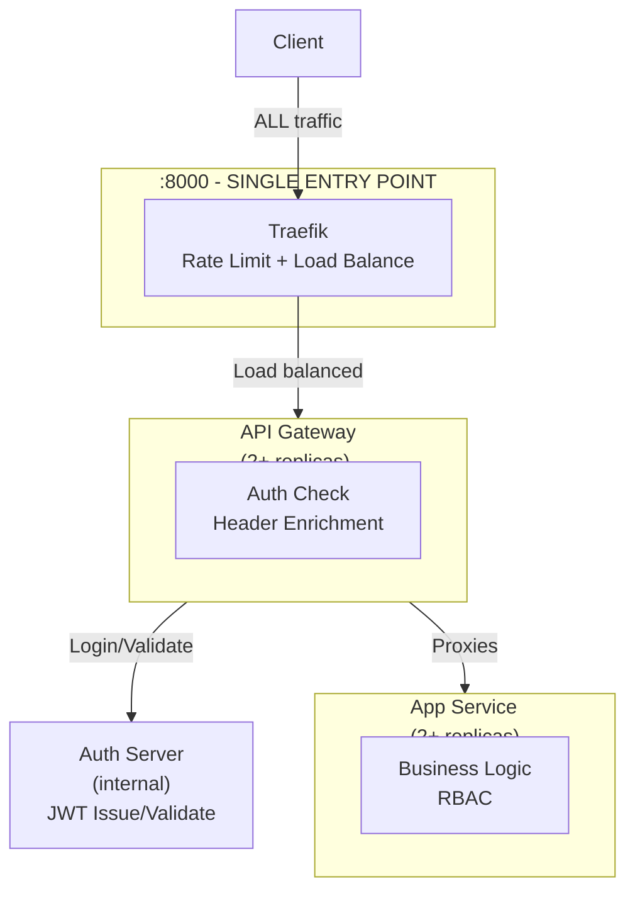

# Quick Start Guide

## Starting the Services

```bash
cd auth
docker-compose up -d
```

Wait for all services to be healthy (~10 seconds), then verify:
```bash
docker-compose ps
```

## Testing Rate Limiting

Run the automated test script:
```bash
./test-rate-limit.sh
```

Expected output:
- ✅ Normal requests succeed
- 🚫 Rapid requests get rate limited with HTTP 429
- ✅ Service recovers after waiting

## Manual Testing

### 1. Login and Get Token

```bash
# Login as alice (user role)
TOKEN=$(curl -s -X POST http://localhost:8000/login \
  -H "Content-Type: application/json" \
  -d '{"username":"alice","password":"password123"}' | jq -r '.token')

echo $TOKEN
```

### 2. Access Public Endpoint

```bash
# Anyone can access /api/v1/cowsay
curl -X POST http://localhost:8000/api/v1/cowsay \
  -H "Authorization: Bearer $TOKEN" \
  -H "Content-Type: application/json" \
  -d '{"message":"Hello from alice!"}'
```

### 3. Try Admin Endpoint (Should Fail)

```bash
# alice is not admin - should get 403
curl -X GET http://localhost:8000/api/v1/admin \
  -H "Authorization: Bearer $TOKEN"
```

### 4. Login as Admin

```bash
# Login as admin
ADMIN_TOKEN=$(curl -s -X POST http://localhost:8000/login \
  -H "Content-Type: application/json" \
  -d '{"username":"admin","password":"admin123"}' | jq -r '.token')

# Now admin endpoint works
curl -X GET http://localhost:8000/api/v1/admin \
  -H "Authorization: Bearer $ADMIN_TOKEN"
```

### 5. Test Rate Limiting

```bash
# Send 100 rapid requests - many will be rate limited
for i in {1..100}; do 
  curl -s -o /dev/null -w "%{http_code} " \
    -X POST http://localhost:8000/api/v1/cowsay \
    -H "Authorization: Bearer $TOKEN" \
    -H "Content-Type: application/json" \
    -d "{\"message\":\"Test $i\"}"
done
echo ""
```

You should see many `429` (Rate Limited) responses.

## Available Users

| Username | Password     | Role  | Access                    |
|----------|--------------|-------|---------------------------|
| alice    | password123  | user  | Public endpoints only     |
| bob      | password456  | user  | Public endpoints only     |
| admin    | admin123     | admin | All endpoints + admin API |

## Monitoring

### Traefik Dashboard
Open http://localhost:8080/dashboard/ to see:
- Active services and health status
- Load balancing distribution
- Rate limiting in action
- Request routing

### Service Health
```bash
# Check all service health
docker-compose ps

# View logs from all replicas of a service
docker-compose logs -f api-gateway
docker-compose logs -f app
docker-compose logs -f auth-server
docker-compose logs -f traefik

# View logs from specific replica instance
docker logs -f auth-api-gateway-1
docker logs -f auth-app-1
```

## Architecture Summary



**Key Points**:
- **API Gateway** is the true entry point - handles ALL requests including `/login`
- **Auth Server** is internal only - accessed by gateway for JWT operations
- **Traefik** provides load balancing and rate limiting in front of the gateway
- **App Service** trusts gateway headers for authorization (RBAC)

## Rate Limiting Details

- **Average**: 10 requests per second
- **Burst**: 20 requests allowed in short bursts
- **Response**: HTTP 429 (Too Many Requests) when limit exceeded
- **Recovery**: Automatic once request rate drops below limit
- **Scope**: Applied at Traefik level before reaching API Gateway

## Scaling Services

To scale services, edit `docker-compose.yml` or use:
```bash
# Scale to more replicas
docker-compose up --scale api-gateway=5 --scale app=10 -d
```

## Stopping Services

```bash
docker-compose down
```

To remove volumes and clean up completely:
```bash
docker-compose down -v
```
