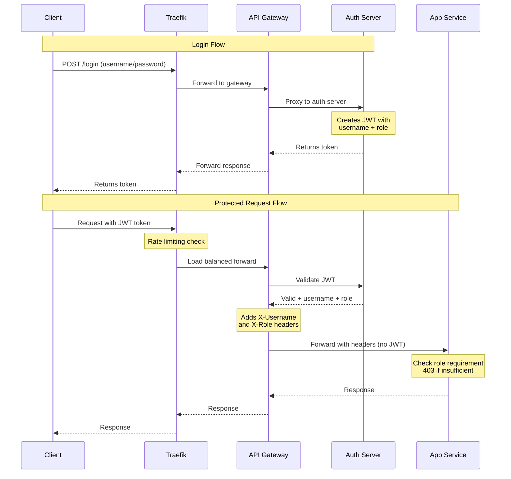

# RBAC Implementation Summary

## What Was Added

### 1. **Roles in JWT Tokens**
- JWT tokens now include a `role` field in the claims
- Roles are assigned during login based on user
- Roles are validated along with the token

### 2. **User Roles Mapping**
```go
var userRoles = map[string]string{
    "alice": "user",
    "bob":   "user",
    "admin": "admin",
}
```

### 3. **Role-Based Middleware**
New `requireRole()` middleware that:
- Validates JWT token (via `authMiddleware`)
- Checks if user's role matches required role
- Returns 403 Forbidden if role doesn't match

### 4. **Admin-Only Endpoint**
New `/api/v1/admin` endpoint that:
- Only accessible by users with `admin` role
- Returns admin panel features
- Regular users get 403 Forbidden

## Architecture Flow



## Testing Results

✅ **alice (role: user)**
- ✓ Can access `/api/v1/cowsay`
- ✗ Cannot access `/api/v1/admin` (403 Forbidden)

✅ **bob (role: user)**
- ✓ Can access `/api/v1/cowsay`
- ✗ Cannot access `/api/v1/admin` (403 Forbidden)

✅ **admin (role: admin)**
- ✓ Can access `/api/v1/cowsay`
- ✓ Can access `/api/v1/admin`

## Files Modified

1. **auth-server/main.go**
   - Added `Role` field to `Claims` struct
   - Added `Role` field to `ValidateResponse` struct
   - Added `userRoles` mapping
   - Include role in JWT token creation
   - Return role in validation responses

2. **app/main.go** (consolidated from app1/app2)
   - Uses gateway headers (X-Username, X-Role) instead of JWT validation
   - Added `requireRole()` middleware for authorization
   - Added `adminHandler()` for admin endpoint
   - Registered `/api/v1/admin` route
   - Trusts gateway authentication boundary

3. **api-gateway/main.go**
   - Added `/api/v1/admin` route with authentication

4. **README.md**
   - Updated with RBAC documentation
   - Added user roles table
   - Added RBAC testing section
   - Updated API endpoints tables

5. **test-rbac.sh** (new file)
   - Comprehensive RBAC testing script
   - Tests all user roles and permissions

## How to Use

### Run RBAC Tests
```bash
./test-rbac.sh
```

### Manual Testing
```bash
# Login as admin
ADMIN_TOKEN=$(curl -s -X POST http://localhost:8000/login \
  -H "Content-Type: application/json" \
  -d '{"username":"admin","password":"admin123"}' | jq -r '.token')

# Access admin endpoint
curl -X GET http://localhost:8000/api/v1/admin \
  -H "Authorization: Bearer $ADMIN_TOKEN" | jq '.'

# Login as regular user
USER_TOKEN=$(curl -s -X POST http://localhost:8000/login \
  -H "Content-Type: application/json" \
  -d '{"username":"alice","password":"password123"}' | jq -r '.token')

# Try admin endpoint (will fail with 403)
curl -X GET http://localhost:8000/api/v1/admin \
  -H "Authorization: Bearer $USER_TOKEN"
```

## Security Benefits

1. **Defense in Depth**: Both gateway and backend apps validate roles
2. **Centralized Auth**: All role validation goes through auth server
3. **Stateless**: No session management needed
4. **Scalable**: Can add more roles without changing infrastructure
5. **Auditable**: All access attempts are logged with user and role info

## Future Enhancements

- [ ] Add more granular permissions (read, write, delete)
- [ ] Implement role hierarchy (admin inherits user permissions)
- [ ] Add resource-based access control (RBAC + ABAC)
- [ ] Store roles in database instead of hardcoded map
- [ ] Add role management API endpoints
- [ ] Implement JWT refresh with role updates
