# Authentication & Authorization Proof of Concept

This project demonstrates a microservices architecture with **decoupled authentication and authorization** using JWT tokens.

## Architecture

```mermaid
graph TB
    Client[Client]
    
    subgraph Traefik["Traefik Load Balancer :8000"]
        TLB["SINGLE ENTRY POINT<br/>• Rate Limiting: 10 req/sec avg, burst of 20<br/>• Routes: ALL traffic → api-gateway<br/>• Dashboard: http://localhost:8080/dashboard/"]
    end
    
    AuthServer["Auth Server<br/>(Internal)<br/>• Issues JWT<br/>• Validates tokens<br/>• User roles"]
    
    subgraph Gateway["API Gateway"]
        GW["Gateway Instance<br/>(2+ replicas)<br/>• Proxies /login<br/>• Validates JWT<br/>• Adds X-Username<br/>• Adds X-Role<br/>• Proxies to app"]
    end
    
    subgraph Apps["App Service"]
        App["App Instance<br/>(2+ replicas)<br/>• Business logic<br/>• Authorization<br/>• Trusts gateway"]
    end
    
    Client -->|ALL traffic| TLB
    TLB -->|Round-robin across<br/>all gateway replicas| Gateway
    Gateway -->|Internal calls| AuthServer
    Gateway -->|Docker DNS LB across<br/>all app replicas| Apps
```



### Components

1. **Traefik Load Balancer** (`:8000` - ONLY exposed port)
   - **Single entry point** for ALL client traffic
   - Routes ALL requests to api-gateway replicas
   - Rate limiting: 10 req/sec average, burst of 20 (DDoS protection)
   - Round-robin load balancing between gateway replicas
   - Dashboard at http://localhost:8080/dashboard/

2. **Auth Server** (internal only - not directly accessible)
   - Issues JWT tokens upon successful login
   - Validates JWT tokens for the gateway
   - Manages user credentials and roles
   - **Only accessed by API Gateway** (not Traefik directly)
   - Decoupled from business logic

3. **API Gateway** (horizontally scalable, currently 2 replicas)
   - **True entry point** - ALL traffic flows through here
   - Proxies `/login` requests to auth-server
   - Authentication boundary - validates JWT once per request
   - Calls auth server to validate tokens
   - Adds `X-Username` and `X-Role` headers to proxied requests
   - Forwards requests to app services (no JWT forwarded)
   - Scale by changing `replicas` in docker-compose.yml

4. **App Service** (horizontally scalable, currently 2 replicas)
   - Business logic services (cowsay implementation)
   - Authorization with role-based access control (RBAC)
   - Trusts `X-Username` and `X-Role` headers from gateway
   - No direct JWT validation (trusts the gateway)
   - Scale by changing `replicas` in docker-compose.yml
   - Docker DNS provides automatic load balancing across all replicas

## Key Features

✅ **Rate Limiting**: Traefik blocks DDoS attacks with 10 req/sec average, burst of 20  
✅ **Horizontal Scaling**: Scale to any number of replicas with a single config change  
✅ **Load Balancing**: Automatic round-robin distribution across all service replicas  
✅ **Decoupled Auth**: Authentication at gateway, authorization at app layer  
✅ **JWT-based**: Stateless authentication using JWT tokens  
✅ **Role-Based Access Control (RBAC)**: Users have roles (user, admin) with different permissions  
✅ **High Availability**: Multiple replicas ensure no single point of failure  
✅ **Monitoring**: Traefik dashboard shows service health and routing  
✅ **Health Checks**: All services expose health endpoints  
✅ **Containerized**: Fully containerized with Docker Compose  
✅ **Zero-Config Service Discovery**: Docker DNS handles automatic load balancing
### Prerequisites

- Docker and Docker Compose installed
- curl or any HTTP client

### 1. Start all services

```bash
cd auth
docker-compose up --build
```

Wait for all services to be healthy (~30 seconds).

> 💡 **Note**: By default, this starts 2 replicas each of the API Gateway and App services. You can scale to more replicas - see the [Scaling Services](#scaling-services) section below.

### 2. Login to get JWT token

```bash
# Login as alice
curl -X POST http://localhost:8000/login \
  -H "Content-Type: application/json" \
  -d '{"username":"alice","password":"password123"}'
```

Response:
```json
{
  "token": "eyJhbGciOiJIUzI1NiIsInR5cCI6IkpXVCJ9...",
  "expires_at": "2025-12-30T15:30:00Z"
}
```

Save the token for subsequent requests.

### 3. Call the protected API

```bash
# Set your token
TOKEN="<your-token-from-login>"

# Make cowsay request
curl -X POST http://localhost:8000/api/v1/cowsay \
  -H "Authorization: Bearer $TOKEN" \
  -H "Content-Type: application/json" \
  -d '{"message":"Hello from Go!"}'
```

Response:
```json
{
  "cow": " ---------------- \n< Hello from Go! >\n ---------------- \n        \\   ^__^\n         \\  (oo)\\_______\n            (__)\\       )\\/\\\n                ||----w |\n                ||     ||\n",
  "message": "Hello from Go!",
  "service": "app1",
  "user": "alice"
}
```

The `service` field shows which replica handled the request. With the default 2 replicas, responses alternate between `app1` and `app2`. With more replicas, you'll see round-robin distribution across all instances.

## Scaling Services

The architecture is designed for horizontal scalability. You can easily increase the number of replicas for both the API Gateway and App services.

### Scaling in docker-compose.yml

Edit `docker-compose.yml` and change the `replicas` value:

```yaml
api-gateway:
  # ... other config ...
  deploy:
    replicas: 5  # Scale to 5 gateway instances

app:
  # ... other config ...
  deploy:
    replicas: 10  # Scale to 10 app instances
```

### Scaling with docker-compose command

```bash
# Scale services without editing the file
docker-compose up --scale api-gateway=5 --scale app=10 -d

# Verify scaling
docker-compose ps
```

### How Load Balancing Works at Scale

- **Traefik → API Gateway**: Traefik automatically detects all gateway replicas and distributes traffic using round-robin
- **API Gateway → App**: Docker DNS provides built-in load balancing across all app replicas
- **No configuration changes needed**: Services auto-discover each other via Docker's internal DNS

### Benefits of Scaling

- **Handle more traffic**: Each replica can process requests independently
- **High availability**: If one instance fails, others continue serving traffic
- **Zero configuration**: Load balancing is automatic
- **Cost effective**: Scale only the services that need it (e.g., scale apps more than gateways)

## Available Users

The auth server has the following test users with different roles:

| Username | Password | Role | Permissions |
|----------|----------|------|-------------|
| **alice** | password123 | user | Can access `/api/v1/cowsay` |
| **bob** | password456 | user | Can access `/api/v1/cowsay` |
| **admin** | admin123 | admin | Can access all endpoints including `/api/v1/admin` |

## Role-Based Access Control (RBAC)

The system implements role-based access control where different users have different permissions:

### Testing RBAC

```bash
# Run the comprehensive RBAC test
./test-rbac.sh
```

### Manual RBAC Testing

```bash
# Login as admin
ADMIN_TOKEN=$(curl -s -X POST http://localhost:8000/login \
  -H "Content-Type: application/json" \
  -d '{"username":"admin","password":"admin123"}' | jq -r '.token')

# Access admin endpoint (should work)
curl -X GET http://localhost:8000/api/v1/admin \
  -H "Authorization: Bearer $ADMIN_TOKEN" | jq '.'

# Login as regular user
USER_TOKEN=$(curl -s -X POST http://localhost:8000/login \
  -H "Content-Type: application/json" \
  -d '{"username":"alice","password":"password123"}' | jq -r '.token')

# Try to access admin endpoint (should fail with 403)
curl -X GET http://localhost:8000/api/v1/admin \
  -H "Authorization: Bearer $USER_TOKEN"
```

## API Endpoints

### Public Endpoints (via Traefik at `:8000`)

| Endpoint | Method | Auth Required | Role Required | Description |
|----------|--------|---------------|---------------|-------------|
| `/login` | POST | No | - | Get JWT token |
| `/api/v1/cowsay` | POST | Yes | any | Cowsay service (load balanced) |
| `/api/v1/admin` | GET | Yes | admin | Admin panel (admin only) |
| `/health` | GET | No | - | Health check |
| `/info` | GET | No | - | Gateway information |

### Auth Server (`:8080`) - Internal

| Endpoint | Method | Description |
|----------|--------|-------------|
| `/login` | POST | Issue JWT token |
| `/validate` | POST | Validate token (body) |
| `/validate-header` | GET | Validate token (header) |
| `/health` | GET | Health check |

### App1/App2 (`:8081`, `:8082`) - Internal

| Endpoint | Method | Auth Required | Role Required | Description |
|----------|--------|---------------|---------------|-------------|
| `/api/v1/cowsay` | POST | Yes | any | Generate cowsay |
| `/api/v1/admin` | GET | Yes | admin | Admin panel |
| `/health` | GET | No | - | Health check |
| `/info` | GET | No | - | Service info |

## Testing Script

```bash
#!/bin/bash

echo "=== Auth & Authorization PoC Test ==="
echo ""

# 1. Login
echo "1. Logging in as alice..."
LOGIN_RESPONSE=$(curl -s -X POST http://localhost:8000/login \
  -H "Content-Type: application/json" \
  -d '{"username":"alice","password":"password123"}')

TOKEN=$(echo $LOGIN_RESPONSE | grep -o '"token":"[^"]*' | cut -d'"' -f4)

if [ -z "$TOKEN" ]; then
  echo "❌ Failed to get token"
  exit 1
fi

echo "✅ Token obtained: ${TOKEN:0:50}..."
echo ""

# 2. Test without auth (should fail)
echo "2. Testing without authentication..."
RESPONSE=$(curl -s -w "\n%{http_code}" -X POST http://localhost:8000/api/v1/cowsay \
  -H "Content-Type: application/json" \
  -d '{"message":"Test"}')
  
STATUS=$(echo "$RESPONSE" | tail -n1)
if [ "$STATUS" = "401" ]; then
  echo "✅ Correctly rejected (401 Unauthorized)"
else
  echo "❌ Should have been rejected"
fi
echo ""

# 3. Test with valid auth
echo "3. Testing with valid authentication..."
for i in {1..4}; do
  echo "   Request $i:"
  curl -s -X POST http://localhost:8000/api/v1/cowsay \
    -H "Authorization: Bearer $TOKEN" \
    -H "Content-Type: application/json" \
    -d "{\"message\":\"Request $i\"}" | grep -o '"service":"[^"]*' | cut -d'"' -f4
done
echo ""
echo "✅ Notice the load balancing between service replicas (default: 2 replicas)!"
echo ""

# 4. Test with invalid token
echo "4. Testing with invalid token..."
RESPONSE=$(curl -s -w "\n%{http_code}" -X POST http://localhost:8000/api/v1/cowsay \
  -H "Authorization: Bearer invalid-token-here" \
  -H "Content-Type: application/json" \
  -d '{"message":"Test"}')
  
STATUS=$(echo "$RESPONSE" | tail -n1)
if [ "$STATUS" = "401" ]; then
  echo "✅ Correctly rejected (401 Unauthorized)"
else
  echo "❌ Should have been rejected"
fi

echo ""
echo "=== All tests completed ==="
```

Save this as `test.sh`, make it executable (`chmod +x test.sh`), and run it!

## Architecture Decisions

### Why API Gateway?

1. **True Single Entry Point**: ALL traffic flows through the gateway (via Traefik)
2. **Centralized Authentication**: Validate tokens once before routing to any service
3. **Request Enrichment**: Adds user context (X-Username, X-Role) to all backend requests
4. **Service Abstraction**: Backend services don't need to know about JWT validation
5. **Load Balancing**: Traefik distributes traffic across gateway replicas

### Why Traefik?

1. **Production-Grade Load Balancer**: Industry-standard reverse proxy
2. **Rate Limiting**: Built-in DDoS protection
3. **Service Discovery**: Automatic Docker service detection
4. **Monitoring**: Dashboard for real-time traffic monitoring

### Why Separate Auth Server?

1. **Separation of Concerns**: Auth logic is isolated from business logic
2. **Reusability**: Multiple services can use the same auth server
3. **Scalability**: Can scale auth independently based on demand
4. **Security**: Centralized security management

### Security Considerations

⚠️ **This is a PoC - Not production ready!**

For production, consider:

- Use environment variables for JWT secret (not hardcoded)
- Implement token refresh mechanism
- Use HTTPS/TLS for all communication
- Add rate limiting
- Implement proper logging and monitoring
- Use a database for user management (not in-memory)
- Add CORS configuration
- Implement token revocation/blacklisting
- Use more sophisticated load balancing (e.g., Nginx, Traefik)

## Monitoring

Check service health:

```bash
# External Access (via Traefik at :8000)
curl http://localhost:8000/health
curl http://localhost:8000/info

# Internal services are NOT exposed to host - only accessible within Docker network
# To check internal service health, exec into a container:
docker exec -it api-gateway-1 wget -q -O- http://auth-server:8080/health
docker exec -it api-gateway-1 wget -q -O- http://app:8081/health

# Or check Traefik dashboard for service health
# http://localhost:8080/dashboard/
```

## Logs

View logs from all services:

```bash
docker-compose logs -f
```

View logs from specific service (all replicas):

```bash
docker-compose logs -f api-gateway
docker-compose logs -f auth-server
docker-compose logs -f app
```

View logs from a specific replica instance:

```bash
docker logs -f auth-api-gateway-1
docker logs -f auth-api-gateway-2
docker logs -f auth-app-1
docker logs -f auth-app-2
```

## Stopping the Services

```bash
docker-compose down
```

Clean up (remove volumes):

```bash
docker-compose down -v
```

## Project Structure

```
auth/
├── docker-compose.yml          # Orchestrates all services + replica config
├── README.md                   # This file
├── test.sh                     # Testing script
├── auth-server/
│   ├── main.go                 # JWT issuer & validator
│   ├── go.mod
│   └── Dockerfile
├── api-gateway/
│   ├── main.go                 # Auth proxy + request enrichment
│   ├── go.mod
│   └── Dockerfile              # Scaled to n replicas via docker-compose
└── app/
    ├── main.go                 # Business logic (cowsay + RBAC)
    ├── go.mod
    └── Dockerfile              # Scaled to n replicas via docker-compose
```

**Note**: The `api-gateway` and `app` services are deployed as multiple replicas using Docker Compose's `deploy.replicas` configuration. Each replica runs from the same codebase but as independent container instances.

## Further Enhancements

- [ ] Add database for user management
- [ ] Implement token refresh mechanism
- [x] ~~Add role-based access control (RBAC)~~ - ✅ Implemented
- [ ] Implement circuit breaker pattern
- [ ] Add distributed tracing (OpenTelemetry)
- [ ] Add metrics (Prometheus)
- [ ] Implement health-based load balancing (remove unhealthy instances)
- [ ] Add Redis for distributed rate limiting across replicas
- [ ] Implement service mesh (Istio, Linkerd)
- [ ] Add auto-scaling based on CPU/memory metrics

## License

MIT License - Feel free to use this as a learning resource!
