- # Authentication & Authorization with Envoy Gateway

This project demonstrates a microservices architecture with **decoupled authentication and authorization** using JWT tokens and **Envoy Gateway** for traffic management.

## Architecture

```mermaid
graph TB
    Client[Client]
    
    subgraph Traefik["Traefik Load Balancer :8000"]
        TLB["SINGLE ENTRY POINT<br/>• Routes ALL traffic → Envoy<br/>• Dashboard: http://localhost:8080/dashboard/"]
    end
    
    subgraph Envoy["Envoy Gateway :10000 - Internal"]
        EnvoyProxy["Envoy Proxy<br/>• External Auth Filter<br/>• Routes /login → auth-server<br/>• Routes /api/* → app<br/>• Validates JWT via /auth endpoint<br/>• Adds X-Username, X-Role headers"]
    end
    
    AuthServer["Auth Server :8080<br/>(Internal Only)<br/>• POST /login: Issues JWT tokens<br/>• POST /auth: Validates tokens<br/>• Manages user roles"]
    
    subgraph Apps["App Service :8081 - Internal"]
        App["App Instances<br/>(2 replicas)<br/>• Business logic (cowsay)<br/>• Authorization (RBAC)<br/>• Trusts X-Username, X-Role<br/>from Envoy"]
    end
    
    Client -->|"ALL requests"| TLB
    TLB -->|"Forward to Envoy"| Envoy
    Envoy -->|"1. /login requests"| AuthServer
    Envoy -.->|"2. Auth check call<br/>/auth endpoint"| AuthServer
    Envoy -->|"3. /api/* requests<br/>(load balanced)"| Apps
```



### Components

1. **Traefik Load Balancer** (`:8000` - ONLY exposed port)
   - Single entry point for ALL client traffic
   - Routes ALL requests to Envoy Gateway
   - Dashboard at http://localhost:8080/dashboard/

2. **Envoy Gateway** (`:10000` - internal)
   - Production-grade API Gateway and proxy
   - **External Authorization Filter**: Delegates authentication to auth-server
   - Validates JWT tokens by calling auth-server's `/auth` endpoint
   - Adds `X-Username` and `X-Role` headers from auth response
   - Routes traffic to backend services
   - Built-in load balancing across app replicas
   - Health checks for all upstream services

3. **Auth Server** (`:8080` - internal only)
   - Issues JWT tokens upon successful login
   - Validates JWT tokens for Envoy (via `/auth` endpoint)
   - Manages user credentials and roles
   - Follows Envoy's external auth protocol
   - Decoupled from business logic

4. **App Service** (`:8081` - internal, 2 replicas)
   - Business logic services (cowsay implementation)
   - Authorization with role-based access control (RBAC)
   - Trusts `X-Username` and `X-Role` headers from Envoy
   - No direct JWT validation (trusts Envoy Gateway)
   - Scale by changing `replicas` in docker-compose.yml

## Key Features

✅ **Envoy Gateway**: Industry-standard API Gateway with powerful routing and auth capabilities  
✅ **External Auth**: Envoy's ext_authz filter delegates authentication to dedicated auth service  
✅ **Horizontal Scaling**: Scale to any number of replicas with a single config change  
✅ **Load Balancing**: Envoy's built-in load balancing across all service replicas  
✅ **Health Checks**: Automatic health monitoring of all upstream services  
✅ **Decoupled Auth**: Authentication at gateway, authorization at app layer  
✅ **JWT-based**: Stateless authentication using JWT tokens  
✅ **Role-Based Access Control (RBAC)**: Users have roles (user, admin) with different permissions  
✅ **Production-Ready Gateway**: Envoy is battle-tested in production environments  
✅ **Containerized**: Fully containerized with Docker Compose  

## Quick Start

### Prerequisites

- Docker and Docker Compose installed
- curl or any HTTP client

### 1. Start all services

```bash
cd auth2
docker compose up --build
```

Wait for all services to be healthy (~30 seconds).

> 💡 **Note**: By default, this starts 2 replicas of the App service. Envoy handles load balancing automatically.

### 2. Login to get JWT token

```bash
# Login as alice
curl -X POST http://localhost:8000/login \
  -H "Content-Type: application/json" \
  -d '{"username":"alice","password":"password123"}'
```

Response:
```json
{
  "token": "eyJhbGciOiJIUzI1NiIsInR5cCI6IkpXVCJ9...",
  "expires_at": "2026-02-08T15:30:00Z"
}
```

Save the token for subsequent requests.

### 3. Call the protected API

```bash
# Set your token
TOKEN="<your-token-from-login>"

# Make cowsay request
curl -X POST http://localhost:8000/api/v1/cowsay \
  -H "Authorization: Bearer $TOKEN" \
  -H "Content-Type: application/json" \
  -d '{"message":"Hello from Envoy!"}'
```

Response:
```json
{
  "cow": " ------------------- \n< Hello from Envoy! >\n ------------------- \n        \\   ^__^\n         \\  (oo)\\_______\n            (__)\\       )\\/\\\n                ||----w |\n                ||     ||\n",
  "message": "Hello from Envoy!",
  "service": "app",
  "instance": "abc123",
  "user": "alice"
}
```

## Available Users

The auth server has the following test users with different roles:

| Username | Password | Role | Permissions |
|----------|----------|------|-------------|
| **alice** | password123 | user | Can access `/api/v1/cowsay` |
| **bob** | password456 | user | Can access `/api/v1/cowsay` |
| **admin** | admin123 | admin | Can access all endpoints including `/api/v1/admin` |

## Role-Based Access Control (RBAC)

The system implements role-based access control where different users have different permissions:

### Testing RBAC

```bash
# Run the comprehensive RBAC test
./test-rbac.sh
```

### Manual RBAC Testing

```bash
# Login as admin
ADMIN_TOKEN=$(curl -s -X POST http://localhost:8000/login \
  -H "Content-Type: application/json" \
  -d '{"username":"admin","password":"admin123"}' | jq -r '.token')

# Access admin endpoint (should work)
curl -X GET http://localhost:8000/api/v1/admin \
  -H "Authorization: Bearer $ADMIN_TOKEN" | jq '.'

# Login as regular user
USER_TOKEN=$(curl -s -X POST http://localhost:8000/login \
  -H "Content-Type: application/json" \
  -d '{"username":"alice","password":"password123"}' | jq -r '.token')

# Try to access admin endpoint (should fail with 403)
curl -X GET http://localhost:8000/api/v1/admin \
  -H "Authorization: Bearer $USER_TOKEN"
```

## API Endpoints

### Public Endpoints (via Traefik at `:8000`)

| Endpoint | Method | Auth Required | Role Required | Description |
|----------|--------|---------------|---------------|-------------|
| `/login` | POST | No | - | Get JWT token |
| `/api/v1/cowsay` | POST | Yes | any | Cowsay service (load balanced) |
| `/api/v1/admin` | GET | Yes | admin | Admin panel (admin only) |
| `/health` | GET | No | - | Health check |

## Monitoring

### Traefik Dashboard
View service health and routing: http://localhost:8080/dashboard/

### Envoy Admin Interface
Access Envoy's admin interface (inside Docker network only):

```bash
# View stats
docker exec -it auth2-envoy wget -q -O- http://localhost:9901/stats

# View config
docker exec -it auth2-envoy wget -q -O- http://localhost:9901/config_dump

# View clusters
docker exec -it auth2-envoy wget -q -O- http://localhost:9901/clusters
```

### Service Health

```bash
# Via Traefik (external access)
curl http://localhost:8000/health

# Direct service checks (inside Docker network)
docker exec -it auth2-envoy wget -q -O- http://auth-server:8080/health
docker exec -it auth2-envoy wget -q -O- http://app:8081/health
```

## Logs

View logs from all services:

```bash
docker compose logs -f
```

View logs from specific service:

```bash
docker compose logs -f envoy
docker compose logs -f auth-server
docker compose logs -f app
```

## Stopping the Services

```bash
docker compose down
```

Clean up (remove volumes):

```bash
docker compose down -v
```

## Scaling Services

You can easily increase the number of replicas for the App service:

```bash
# Edit docker-compose.yml and change replicas value
# OR scale using command:
docker compose up --scale app=5 -d

# Verify scaling
docker compose ps
```

Envoy automatically detects all app replicas and distributes traffic using round-robin load balancing.

## Project Structure

```
auth2/
├── docker-compose.yml          # Orchestrates all services
├── envoy.yaml                  # Envoy Gateway configuration
├── README.md                   # This file
├── test.sh                     # Testing script
├── test-rbac.sh               # RBAC testing script
├── auth-server/
│   ├── main.go                 # JWT issuer & validator + Envoy auth endpoint
│   ├── go.mod
│   └── Dockerfile
└── app/
    ├── main.go                 # Business logic (cowsay + RBAC)
    ├── go.mod
    └── Dockerfile              # Scaled to n replicas via docker compose
```

## Architecture Decisions

### Why Envoy Gateway?

1. **Industry Standard**: Battle-tested in production (used by Lyft, Apple, etc.)
2. **External Auth Filter**: Native support for delegating authentication to external services
3. **Advanced Load Balancing**: Multiple algorithms, health checks, circuit breakers
4. **Observability**: Rich metrics, tracing, and logging capabilities
5. **Performance**: Written in C++, extremely fast and efficient
6. **Flexibility**: Powerful routing, retries, timeouts, and more

### Why Traefik as Entry Point?

1. **Easy Configuration**: Docker label-based configuration
2. **Service Discovery**: Automatic Docker service detection
3. **Dashboard**: Real-time traffic monitoring
4. **Production-Grade**: Widely used in production environments

### Why Separate Auth Server?

1. **Separation of Concerns**: Auth logic is isolated from business logic
2. **Reusability**: Multiple services can use the same auth server
3. **Envoy Integration**: Follows Envoy's external auth protocol
4. **Scalability**: Can scale auth independently based on demand

### Envoy External Auth Flow

1. Client sends request with JWT to Traefik (`:8000`)
2. Traefik forwards to Envoy Gateway (`:10000`)
3. Envoy's ext_authz filter intercepts protected routes
4. Envoy calls auth-server's `/auth` endpoint with Authorization header
5. Auth-server validates JWT and returns headers (X-Username, X-Role)
6. If valid (200 OK), Envoy adds headers and forwards to app
7. If invalid (401), Envoy returns error to client
8. App trusts Envoy's headers and performs authorization

## Security Considerations

⚠️ **This is a PoC - Not production ready!**

For production, consider:

- Use environment variables for JWT secret (not hardcoded)
- Implement token refresh mechanism
- Use HTTPS/TLS for all communication
- Add rate limiting (Envoy supports this)
- Implement proper logging and monitoring
- Use a database for user management (not in-memory)
- Add CORS configuration in Envoy
- Implement token revocation/blacklisting
- Configure Envoy's retry policies and circuit breakers
- Enable Envoy access logs and metrics
- Use mutual TLS between services

## Benefits Over Custom API Gateway

| Feature | Custom Gateway (auth) | Envoy Gateway (auth2) |
|---------|----------------------|----------------------|
| **Maintenance** | Custom code to maintain | Battle-tested, community supported |
| **Performance** | Good (Go) | Excellent (C++) |
| **Features** | Basic proxying | Advanced routing, retries, circuit breakers |
| **Observability** | Manual implementation | Built-in metrics, tracing |
| **Load Balancing** | Basic round-robin | Multiple algorithms, health checks |
| **Auth Integration** | Custom implementation | Native ext_authz filter |
| **Production Ready** | Requires hardening | Production-grade out of the box |

## Further Enhancements

- [ ] Add database for user management
- [ ] Implement token refresh mechanism
- [x] ~~Add role-based access control (RBAC)~~ - ✅ Implemented
- [ ] Configure Envoy circuit breakers
- [ ] Add distributed tracing (OpenTelemetry with Envoy)
- [ ] Enable Envoy access logs
- [ ] Add Prometheus metrics scraping from Envoy
- [ ] Implement rate limiting in Envoy
- [ ] Add Redis for distributed session management
- [ ] Configure mutual TLS between services
- [ ] Add Envoy retry policies

## Comparison: auth vs auth2

### auth (Custom API Gateway)
- **Gateway**: Custom Go application
- **Auth**: JWT validation in gateway
- **Pros**: Simple, easy to understand
- **Cons**: Custom code to maintain, limited features

### auth2 (Envoy Gateway)
- **Gateway**: Envoy Proxy (industry standard)
- **Auth**: Envoy ext_authz filter → auth-server
- **Pros**: Production-ready, feature-rich, well-maintained
- **Cons**: More complex configuration

## License

MIT License - Feel free to use this as a learning resource!
