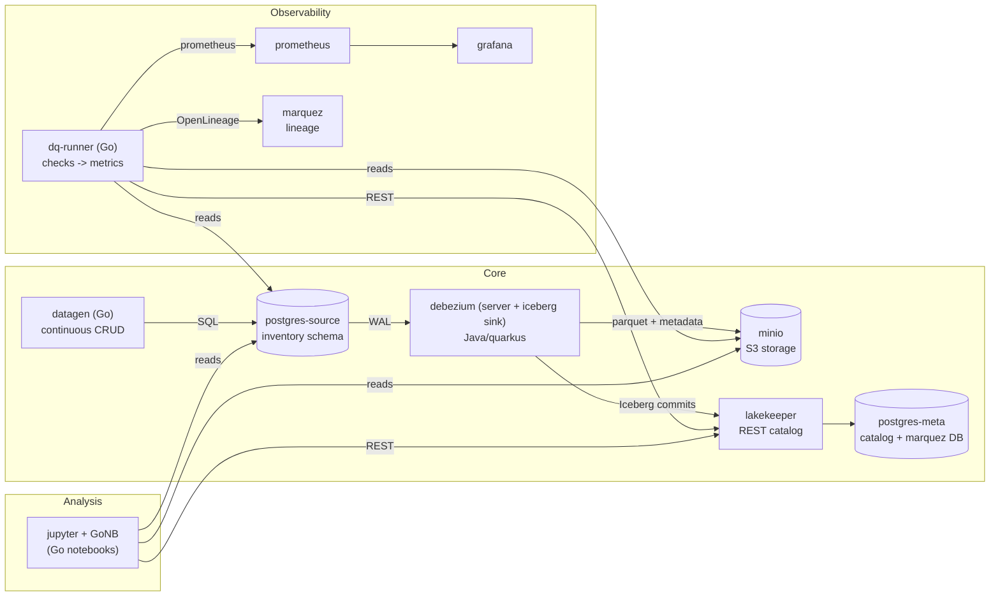
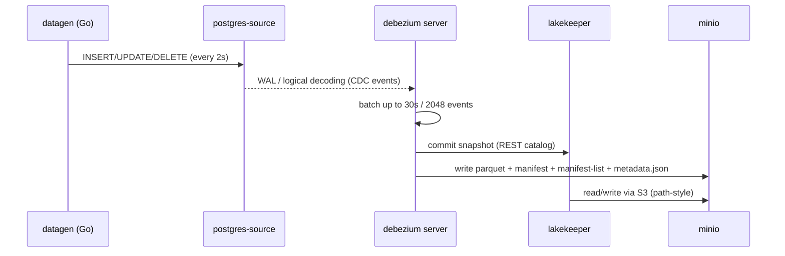
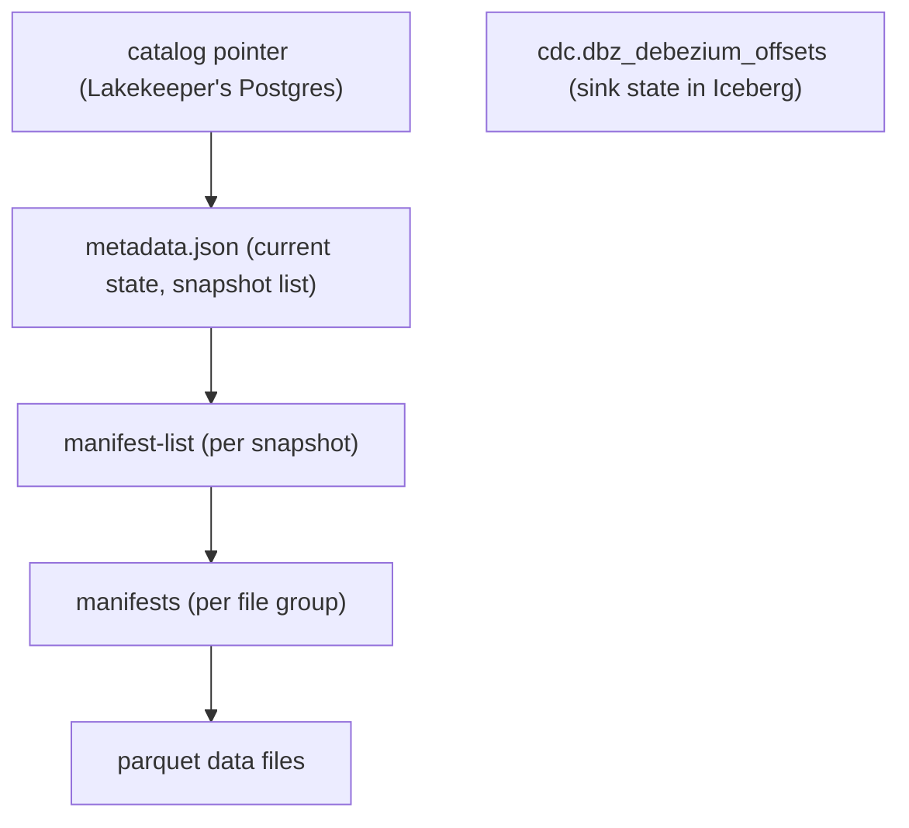
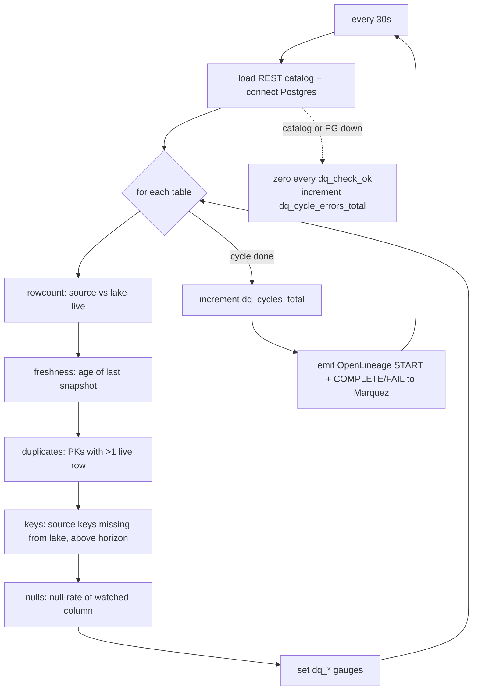

# Architecture

This document explains how the **debezium-iceberg** lab is put together: a
Kafka-less CDC pipeline where changes in a Postgres database flow straight into
an **Iceberg** lakehouse, with a data-quality loop, observability and analysis
on top. It is a Go re-implementation of
[tarodo/debezium-iceberg-lab](https://github.com/tarodo/debezium-iceberg-lab):
the Python components (`datagen`, `dq/`) were ported to Go and the Python
analysis notebooks were rewritten as **GoNB** notebooks.

## System overview



## Components

| component | image / language | role |
|---|---|---|
| `postgres-source` | `quay.io/debezium/example-postgres:3.6` | source of truth; seeds the `inventory` schema (customers, products, products_on_hand, orders) |
| `datagen` | Go (`cmd/datagen`) | generates continuous CRUD traffic so the pipeline always has fresh events |
| `debezium` | `ghcr.io/memiiso/debezium-server-iceberg:1.0.0.Final` | Debezium Server + Iceberg sink: reads the Postgres WAL, batches events, commits snapshots to Iceberg |
| `minio` | `minio/minio:RELEASE.2025-09-07T16-13-09Z` | S3-compatible object storage for all Iceberg data and metadata files |
| `lakekeeper` | `quay.io/lakekeeper/catalog:v0.13.1` | Iceberg REST catalog; its own state lives in `postgres-meta` |
| `postgres-meta` | `postgres:17-alpine` | backing DB for Lakekeeper (and Marquez) |
| `dq-runner` | Go (`cmd/dq run`) | data-quality loop: reconciles Postgres vs Iceberg every 30s, exposes Prometheus gauges, emits OpenLineage |
| `verify` | Go (`cmd/dq`, `tests/`) | `make verify` runs the integration tests; `make maintain` runs `dq maintain` |
| `prometheus` / `grafana` | `v3.13.2` / `13.0.6` | scrape `dq-runner:8000`, Debezium; dashboard "CDC Stand" |
| `marquez` / `marquez-web` | `0.51.1` / `0.51.1` | OpenLineage lineage of the DQ cycles |
| `jupyter` | `janpfeifer/gonb_jupyterlab:v0.11.5` | JupyterLab with the **GoNB** Go kernel; serves the `notebooks/*.ipynb` |

The table above is a quick reference. The next section explains every component
in depth: what it is, why it is here, and how it connects to the others.

## Component deep dive

### 1. `postgres-source` — the source of truth

- **What.** The transactional database at the head of the pipeline. It is the
  `quay.io/debezium/example-postgres:3.6` image, which seeds the `inventory`
  schema (customers, products, products_on_hand, orders) with sample rows and
  starts logical decoding out of the box.
- **Why.** Change Data Capture needs a real OLTP database with a WAL to decode.
  The Debezium example image removes all setup: the schema matches Debezium's
  own documentation, so what you read in the sink config and the notebooks
  matches upstream tutorials. Everything downstream is derived from this
  database, which is why it is called the *source of truth*.
- **Connections.**
  - **in**: `datagen` sends INSERT/UPDATE/DELETE over SQL.
  - **out**: `debezium` decodes the WAL through a replication slot;
    `dq-runner` queries it for counts/keys; the notebooks read it to demo writes
    and reconciliation.

### 2. `datagen` (Go) — the traffic generator

- **What.** A tiny static Go binary (`cmd/datagen`) that runs a weighted pool of
  CRUD operations (insert/update/delete customers, insert orders, update
  stock/product) every `DATAGEN_INTERVAL_SECONDS` (default 2s) against the
  source.
- **Why.** A CDC pipeline with no writes produces nothing: no WAL events, no new
  snapshots, no metrics movement. The generator keeps the stream alive so the
  freshness check is meaningful, row counts keep moving, and there is always
  data to query and reconcile. It was ported from `gen.py` so the whole lab
  runs on Go binaries.
- **Connections.**
  - **out**: writes SQL to `postgres-source` only. It never talks to the lake —
    its changes reach Iceberg indirectly through Debezium.

### 3. `debezium` (server + Iceberg sink) — the CDC engine

- **What.** Debezium Server (Java/Quarkus) with the memiiso **Iceberg sink**
  (`ghcr.io/memiiso/debezium-server-iceberg:1.0.0.Final`), configured entirely
  in `debezium/application.properties`. It reads the Postgres WAL, transforms
  each change into an Iceberg upsert, batches them, and commits snapshots.
- **Why.** This is the heart of the "Kafka-less" architecture: Debezium Server
  captures Postgres changes without a Kafka broker, and the sink writes them
  straight into a lakehouse. The sink also owns the hard parts of the lab —
  batching (`MaxBatchSizeWait`, up to 30s/2048 events), in-batch upsert
  dedup, schema evolution, flattening (`ExtractNewRecordState`), and storing
  its own offsets **inside Iceberg**.
- **Key configuration.**
  - source: `PostgresConnector`, `table.include.list=inventory.*`, prefix `dbz`;
  - sink: REST catalog at `http://lakekeeper:8181/catalog`, warehouse
    `lakehouse`, namespace `cdc`, `upsert=true`, `upsert-keep-deletes=true`,
    S3 path-style against MinIO;
  - transforms: unwrap → adds `__deleted`, `op`, `table`, `source.ts_ms`,
    `source.ts_ns` (the dedup sort key).
- **Connections.**
  - **in**: Postgres WAL from `postgres-source`.
  - **out**: commits metadata to `lakekeeper` (REST); writes parquet + Iceberg
    metadata files to `minio`; records offsets in the `cdc.dbz_debezium_offsets`
    lake table.
  - **monitoring**: exposes `/q/metrics` on `:8080` and a JMX exporter on
    `:9404`, both scraped by Prometheus.
  - **analysis**: its offset table is inspected by notebook 01.

### 4. `minio` — the object store

- **What.** S3-compatible storage (`minio/minio:RELEASE.2025-09-07T16-13-09Z`) with a single bucket
  `warehouse` created at startup by `minio-init`.
- **Why.** Iceberg is a *table format on object storage*: data files, manifests,
  manifest-lists and `metadata.json` are all objects in a bucket. MinIO gives a
  local, inspectable S3 (console on `:9001`, `mc` CLI) so the lab needs no cloud
  account — the whole lake lives on your machine.
- **Connections.**
  - **in**: `debezium` writes parquet + metadata; `lakekeeper` reads/writes
    table files through its storage profile (endpoint `http://minio:9000`,
    path-style access, prefix `lakehouse`).
  - **out**: `dq-runner` and the notebooks read the data through the catalog's
    S3 file IO. MinIO is where you visually confirm the metadata chain.

### 5. `lakekeeper` — the REST catalog

- **What.** An Iceberg REST catalog (`quay.io/lakekeeper/catalog:v0.13.1`) backed
  by Postgres. Four one-shot helpers set it up: `lakekeeper-migrate` (schema
  migrations), `lakekeeper` (serves the API/UI), `lakekeeper-bootstrap` and
  `lakekeeper-init-warehouse` (accept the terms of use and register the
  `lakehouse` warehouse pointing at MinIO).
- **Why.** Iceberg cannot be read by guessing file paths — clients need a
  **catalog** that resolves a table name to its current `metadata.json`. A REST
  catalog is the standard, interoperable interface: the Debezium sink, the Go
  reader (`iceberg-go`), the DQ loop and the notebooks all speak the same REST
  protocol, so no client needs direct file knowledge. Lakekeeper was chosen as a
  lightweight, self-contained REST catalog that runs in one container.
- **Connections.**
  - **in**: metadata commits from `debezium`; catalog queries from `dq-runner`
    and `jupyter`.
  - **out**: persists all catalog state in `postgres-meta`; reads/writes table
    files in `minio` via its S3 storage profile.
  - **UI**: human browsing at `http://localhost:8181/ui/`.

### 6. `postgres-meta` — Lakekeeper's (and Marquez's) database

- **What.** The internal `postgres:17-alpine` instance. Lakekeeper stores its
  catalog metadata here; the init script `postgres-meta/init/01-marquez.sql`
  also creates a dedicated `marquez` role + database for Marquez.
- **Why.** A REST catalog needs transactional storage for table/namespace state,
  and sharing one small Postgres with Marquez keeps the stand compact (one extra
  DB instead of two).
- **Connections.**
  - **out**: `lakekeeper` uses the `lakekeeper` database (read/write URLs);
    `marquez` uses the `marquez` database. No other component talks to it.

### 7. `dq-runner` (Go) — the data-quality loop

- **What.** The Go DQ loop (`cmd/dq run`). Every `DQ_INTERVAL_SECONDS` (30s) it
  reconciles each table: source rowcount vs lake live rowcount, freshness of the
  last snapshot, duplicate PKs, key-level divergence, and a null-rate check. It
  exposes the `dq_*` gauges on `:8000/metrics` and emits OpenLineage
  START/COMPLETE/FAIL events to Marquez.
- **Why.** The pipeline can be up while data is wrong (a lost row, a lagging
  sink, a dead catalog). The DQ loop turns "is the lake healthy?" into numbers
  that Grafana can plot and alerts can watch. It was ported from Python and
  reads Iceberg with `iceberg-go` + `arrow-go`, which **apply equality-delete
  files during the scan** — so "live rows" are correct by construction (the
  reason the Python version needed DuckDB).
- **Connections.**
  - **in**: reads counts/keys from `postgres-source` (pgx); loads tables +
    current snapshots from `lakekeeper` (REST); reads parquet from `minio`
    through the catalog's S3 file IO.
  - **out**: `prometheus` scrapes `:8000/metrics`; `marquez` receives lineage
    events. It is deliberately *not* a writer to the lake.

### 8. `verify` — the test / maintenance runner

- **What.** A compose-only service built from the same Go image as `dq-runner`.
  It runs the stand-level integration tests (`integration.test -test.v`) for
  `make verify`, or the maintenance job (`dq maintain`) for `make maintain`.
- **Why.** Automation: the integration tests prove the whole stand works end to
  end (tables created, rowcounts reconcile, an insert propagates, Prometheus
  targets are up, the `dq_check` job appears in Marquez), and the maintenance
  job keeps snapshots from growing without bound. Both would otherwise be manual
  and easy to skip.
- **Connections.** Uses the same `DQ_*` environment as `dq-runner`
  (`postgres-source`, `lakekeeper`, `minio`), and asserts against `prometheus`,
  `grafana` and `marquez`. Not a long-running service — it starts, runs, exits.

### 9. `prometheus` — the metrics store

- **What.** `prom/prometheus:v3.13.2`, scraping three jobs defined in
  `observability/prometheus/prometheus.yml`: `dq-runner` (`:8000`),
  `debezium-quarkus` (`/q/metrics`) and `debezium-connector` (JMX `:9404`).
- **Why.** DQ checks and Debezium metrics are only useful over time. Prometheus
  keeps the time series so the failure scenarios (lag, catalog outage, paused
  generator) leave a visible trail in Grafana.
- **Connections.**
  - **in**: scrape targets `dq-runner`, `debezium`.
  - **out**: served to `grafana` as the datasource.

### 10. `grafana` — the dashboard

- **What.** `grafana/grafana:13.0.6`, provisioned from
  `observability/grafana/provisioning` (datasource → Prometheus, dashboard →
  "CDC Stand", uid `cdc-stand`).
- **Why.** The `dq_*` gauges are meant to be watched: rowcount diff, freshness,
  check health per table. Grafana turns the lab's health into panels; alert
  rules are left as a manual exercise (not provisioned).
- **Connections.**
  - **in**: reads the Prometheus datasource.
  - **out**: web UI on `:3000` (`admin`/`admin`). Nothing else depends on it.

### 11. `marquez` / `marquez-web` — the lineage store

- **What.** The OpenLineage server (`marquezproject/marquez:0.51.1`) + web UI
  (`marquez-web:0.51.1`, `:3001`). `dq-runner` is the lineage source: every DQ
  cycle records inputs (Postgres tables) and outputs (Iceberg tables) under
  namespace `cdc-stand`, job `dq_check`.
- **Why.** Data lineage answers "what produced this table / what does this table
  feed?". OpenLineage from Debezium itself is unavailable in the memiiso build,
  so the DQ runner is the pragmatic source of lineage — and it makes the DQ
  cycles auditable, not just their metrics.
- **Connections.**
  - **in**: OpenLineage events posted by `dq-runner` to `http://marquez:5000`.
  - **out**: `marquez-web` renders the API; state persists in `postgres-meta`
    (the `marquez` database).

### 12. `jupyter` (GoNB) — the analysis layer

- **What.** JupyterLab with the **GoNB** Go kernel
  (`janpfeifer/gonb_jupyterlab:v0.11.5`), serving the Go notebooks in
  `notebooks/` (mounted at `/notebooks/work`, token `lake`). The notebooks
  import the same Go libraries the services use (`iceberg-go`, `arrow-go`,
  `pgx`).
- **Why.** The lab is a teaching stand: the notebooks walk through the Iceberg
  metadata chain, querying + time travel, CDC semantics, and the known sink
  failure cases. Writing them in Go (GoNB) keeps **one language across the whole
  repo** — analysis code, the DQ loop and the services all share the same
  libraries and idioms, instead of mixing Python/PyIceberg/DuckDB with Go.
- **Connections.**
  - **in**: reads tables from `lakekeeper` (REST), data from `minio`, and the
    source from `postgres-source` (pgx). It is a read-only explorer of the lake
    (notebook 03 writes to the *source*, never to Iceberg).

## Data flow (Postgres -> Iceberg)



The sink is in **upsert mode** with `upsert-keep-deletes=true`:

- every change appends a new row version;
- every UPDATE/DELETE also writes an **equality-delete** file;
- deletes are **soft** (`__deleted=true`) - the data file stays, so the lake
  grows without bound (this is why readers must apply delete files and why the
  DQ loop scans a narrow column projection).

### Metadata chain



## The Go data-quality loop (`dq-runner`)

`cmd/dq` is a single binary with two subcommands:

- `dq run` - the DQ loop (default);
- `dq maintain` - Iceberg snapshot maintenance (`make maintain`).



Key behaviours, preserved from the Python lab:

- **iceberg-go + arrow-go** replace DuckDB: the scan applies equality/positional
  delete files, so "live rows" are correct by construction;
- a **per-table timeout** (`DQ_HTTP_TIMEOUT_MS`) means a hung MinIO/Lakekeeper
  stalls one check, not the whole loop - the metrics endpoint keeps serving;
- a failed table zeroes *only its own* `dq_check_ok` gauges; a failed cycle
  zeroes *all* of them - otherwise a dead catalog would look "all green";
- the `keys` check compares **key sets, not counts** (a single lost row hides
  inside the row-count tolerance) and excludes keys above the lake's highest
  key so ordinary batching lag does not trip it;
- lineage is **best-effort**: a missing/broken `OPENLINEAGE_URL` disables it
  instead of killing the loop.

### Metrics

`dq-runner` exposes the gauges on `:8000/metrics` (scraped by Prometheus):

| metric | meaning |
|---|---|
| `dq_check_ok{table,check}` | 1 if a check passed (check ∈ rowcount, freshness, duplicates, keys, nulls) |
| `dq_rowcount_source/iceberg/diff` | source rows, lake live rows, absolute diff |
| `dq_freshness_seconds` | age of the last snapshot (`-1` = none yet) |
| `dq_duplicate_pk_rows` | live rows sharing a PK beyond the first |
| `dq_missing_keys` / `dq_extra_keys` | live in source but absent from lake / vice versa |
| `dq_null_rate{table,column}` | fraction of NULLs in a watched column |
| `dq_cycles_total` / `dq_cycle_errors_total` | completed cycles / errors |

## `dq maintain` (table maintenance)

Every run:

1. ensures the metadata retention properties
   (`write.metadata.delete-after-commit.enabled=true`,
   `write.metadata.previous-versions-max=25`);
2. expires snapshots older than `MAINT_MAX_AGE_HOURS` (default 2h), always
   keeping the last `MAINT_RETAIN_LAST` (default 20).

Physical bin-packing of small parquet files and row-level dedup are **not**
done here - in production that is an offline Trino/Spark job.

## Go source layout

```
debezium-iceberg/
├── cmd/
│   ├── dq/           # dq run | dq maintain
│   └── datagen/      # CRUD generator
├── internal/
│   └── dq/
│       ├── checks.go       # pure check functions (unit tested)
│       ├── iceberg.go      # REST catalog + narrow scans (iceberg-go/arrow-go)
│       ├── runner.go       # Prometheus metrics + DQ loop
│       ├── lineage.go      # OpenLineage -> Marquez
│       ├── maintenance.go  # snapshot expiry + metadata props
│       └── config.go       # env configuration
├── tests/           # stand-level integration tests (make verify)
├── notebooks/       # GoNB analysis notebooks (01-05)
├── datagen/ dq/     # Dockerfiles (multi-stage, static binaries)
├── debezium/ lakekeeper/ postgres-meta/ observability/ jupyter/   # infra
├── docker-compose.yaml
└── Makefile
```

## Why these Go choices

| concern | Python lab | this port |
|---|---|---|
| Iceberg reads | DuckDB (PyIceberg cannot read equality deletes) | `apache/iceberg-go` + `apache/arrow-go` - deletes are applied in the scan |
| catalog | PyIceberg REST catalog | `catalog.Load` (REST) with `s3.*` props; `_ "…/io/gocloud"` registers the S3 IO |
| storage | DuckDB HTTP(S) over MinIO | AWS SDK v2 via Go Cloud (path-style auto when `s3.endpoint` is set) |
| DQ loop / maintenance | `dq/` Python | `cmd/dq` Go binary |
| data generator | `datagen/gen.py` | `cmd/datagen` Go binary |
| analysis | Python Jupyter (PyIceberg/DuckDB) | **GoNB** notebooks using the same Go libraries |
| tests | pytest | Go unit tests (`go test ./internal/dq/`) + integration tests |

## Infrastructure (compose)

Profiles keep the stand layered, exactly like the original:

| target | services |
|---|---|
| `make up-core` | postgres-meta, minio(+init), lakekeeper(+migrate/bootstrap/init-warehouse), postgres-source, datagen, debezium |
| `make up-analysis` | core + jupyter (GoNB) |
| `make up-obs` | core + dq-runner, prometheus, grafana, marquez(+web) |
| `make up-all` | everything |

Container images are built from the repo root (`datagen/Dockerfile`,
`dq/Dockerfile`, `jupyter/Dockerfile`); `dq/Dockerfile` also bakes the
integration-test binary (`integration.test`) for the `verify` service.

## Failure scenarios (learning)

1. **Replication lag**: `docker compose stop debezium` -> `dq_freshness_seconds`
   climbs, `dq_check_ok{check="freshness"}` goes dark; `start debezium` catches up.
2. **Catalog unavailable**: `docker compose stop lakekeeper` -> Debezium fails
   and restart-loops (the Go DQ loop instead reports all checks unknown via
   `dq_check_ok=0`, not a stale "green").
3. **Generator paused**: `docker compose stop datagen` -> rowcount diff
   converges to 0, freshness grows.
4. **A row that disappears from the lakehouse**: DELETE + re-INSERT of one key
   in a single transaction - the row stays live in Postgres but soft-deleted in
   Iceberg, and every DQ panel stays green (see notebook 05).
