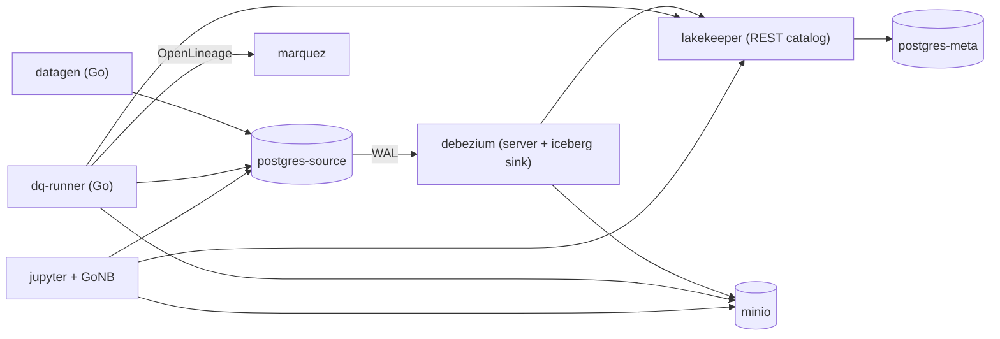

# debezium-iceberg (Go)

Kafka-less CDC lab: **Postgres → Debezium Server → Iceberg on MinIO**, cataloged by
**Lakekeeper**, with observability (Prometheus/Grafana), **data-quality checks**
and lineage (Marquez). The analysis layer runs as **GoNB** notebooks.

This is a Go re-implementation of
[tarodo/debezium-iceberg-lab](https://github.com/tarodo/debezium-iceberg-lab)
(inspired by the article
[Building Kafka-Less Data Integration Pipelines with Debezium](https://debezium.io/blog/2026/07/06/kafka-less-migration/)):

- `datagen` — Go (was Python)
- `dq-runner`, `dq maintain`, integration tests — Go (was Python `dq/` + pytest)
- `notebooks/*.ipynb` — **GoNB** Go notebooks (were Python/PyIceberg/DuckDB)

See [ARCHITECTURE.md](ARCHITECTURE.md) for the full architecture and diagrams.

## Architecture



## Quick start (layered)

```console
make up-core       # core: postgres, minio, lakekeeper, debezium, datagen
make verify        # core smoke tests (needs the stand up)
make verify-unit   # pure check functions only, no stand needed
make up-analysis   # + jupyter with GoNB notebooks
make up-obs        # + prometheus, grafana, dq-runner, marquez
make up-all        # everything: core + analysis + observability
make down          # stop everything
make clean         # stop and remove data (volumes)
```

## Where to look

| what | url | credentials |
|---|---|---|
| MinIO console (data + metadata files) | http://localhost:9001 | `minio` / `minio12345` |
| Lakekeeper UI (catalog, warehouse) | http://localhost:8181/ui/ | no auth |
| Debezium health | http://localhost:8080/q/health | — |
| Debezium JVM/connector metrics | http://localhost:8080/q/metrics | — |
| Jupyter (GoNB notebooks 01-05) | http://localhost:8888 | token `lake` |
| Prometheus | http://localhost:9090 | — |
| Grafana (dashboard "CDC Stand") | http://localhost:3000 | `admin` / `admin` |
| Marquez UI (lineage) | http://localhost:3001 | — |
| DQ metrics | http://localhost:8000/metrics | — |
| Source (psql) | localhost:5433 | `postgres` / `postgres` |

## Metadata map

| layer | location |
|---|---|
| Table data | `s3://warehouse/lakehouse/.../data/*.parquet` |
| Iceberg metadata (metadata.json → manifest-list → manifests) | `s3://warehouse/lakehouse/.../metadata/` |
| Catalog pointer | Lakekeeper's Postgres (`postgres-meta`) |
| Debezium offsets | Iceberg table `cdc.dbz_debezium_offsets` (in MinIO) |

## Notebooks (GoNB)

The `notebooks/*.ipynb` are **GoNB** notebooks (Go kernel), opened in Jupyter.
To rerun: Run → Run All Cells; headless run:

```console
docker compose exec -T jupyter jupyter nbconvert --to notebook --execute --inplace work/01_explore_metadata.ipynb
```

- `01_explore_metadata.ipynb` — the full Iceberg metadata chain (metadata.json → manifest-list → manifests → parquet);
- `02_query_iceberg.ipynb` — querying the lake, reconciliation with the source, time travel (was the DuckDB notebook);
- `03_cdc_semantics.ipynb` — insert/update/delete, soft-delete, schema evolution (writes to the source; with 30s batching a full run takes ~3-5 minutes);
- `04_tx_dedup.ipynb` — in-batch deduplication: two changes of one key inside a single transaction (writes to the source; ~2-4 minutes);
- `05_delete_insert.ipynb` — the one case that goes wrong on a single key: delete-then-reinsert in one transaction, what the DQ checks make of it, and the remediation (needs `docker compose stop datagen` and `make up-obs`).

## DQ checks (dq-runner, every 30s)

- rowcount reconciliation pg ↔ iceberg (tolerance `DQ_ROWCOUNT_TOLERANCE`);
- freshness of the latest snapshot (threshold `DQ_FRESHNESS_MAX_SECONDS`);
- PK duplicates among live rows (should not occur in upsert mode);
- key-level reconciliation: PKs live in the source but absent from the lake
  (`dq_missing_keys`). Counts alone cannot see a single lost row — it hides
  inside the rowcount tolerance. Keys newer than the highest key the lake has
  seen are excluded, so ordinary batching lag does not trip the check;
- null-rate `customers.email`.

Metrics `dq_*` → Prometheus → panel in Grafana. Each cycle sends OpenLineage
events to Marquez (namespace `cdc-stand`, job `dq_check`).

The unit tests run from the host without the stand:

```console
make verify-unit        # go test ./internal/dq/...
```

The integration tests need the full stand up, which is what `make verify` gives
you (runs the baked `integration.test` binary in the compose `verify` service).

## Table maintenance

```console
make maintain    # expire old snapshots + auto-trim metadata.json
```

Thresholds — env: `MAINT_MAX_AGE_HOURS` (2h), `MAINT_RETAIN_LAST` (20). The sink
commits in batches up to 30s (`MaxBatchSizeWait`) — fewer snapshots, larger
files. Physical bin-packing of small parquet files and row-level dedup are not
available here — in production that's a scheduled offline Trino/Spark job.

## Learning failure scenarios

1. **Replication lag**: `docker compose stop debezium` → `dq_freshness_seconds`
   climbs, `dq_check_ok{check="freshness"}` goes dark; `start debezium` catches up.
2. **Catalog unavailable**: `docker compose stop lakekeeper` → Debezium fails
   and enters a restart loop; the Go DQ loop marks every check unknown
   (`dq_check_ok=0`) instead of leaving stale green values. Recovers 1-2
   minutes after `start`.
3. **Generator paused**: `docker compose stop datagen` → row-count diff
   converges to 0, freshness grows.
4. **A row that disappears from the lakehouse**: DELETE + re-INSERT of one key
   inside a single transaction — the row stays live in Postgres and turns up
   soft-deleted in Iceberg (notebook 05).

## Known limitations

- The memiiso Debezium image is amd64-only: on Apple Silicon it runs via emulation (slow startup).
- The `1.1.0.Final`/`latest` tags of the memiiso image are broken on ghcr.io — keep the `1.0.0.Final` pin.
- Host port for the Marquez API is 5002 (5000 is taken by AirPlay Receiver on macOS).
- The freshness check is only meaningful while the datagen is running.
- Grafana alert rules are not implemented — panels provide the base, alerts are added manually.
- OpenLineage from Debezium itself is unavailable in the memiiso build — lineage comes from dq-runner.
- GoNB notebooks auto-`go get` their imports on first use; the image pre-caches
  `apache/iceberg-go`, `pgx`, `arrow-go` and friends so that is hit-free.
