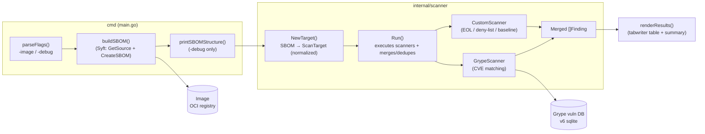

# Image Scanner

A pluggable container image vulnerability scanner built as a Go proof-of-concept. It generates a Software Bill of Materials (SBOM) for a Docker image with [Syft](https://github.com/anchore/syft), cross-references the packages against the [Grype](https://github.com/anchore/grype) vulnerability database, and runs organization-specific policy checks — all through a simple `Scanner` interface so new scanners drop in with a few lines of code.

## Features

- **SBOM generation** — catalogs packages (and their versions, PURLs, CPEs, licenses, locations) from an image using Syft as a library.
- **Known-CVE matching** — matches SBOM packages against the Grype vulnerability database.
- **Pluggable scanners** — a `Scanner` interface with a uniform `Finding` model; Grype is just one scanner, alongside your own.
- **Policy scanner** (example) — EOL distro detection, package deny-list, and an outdated-version security baseline.
- **Structured, colored logging** — `charmbracelet/log` with `key=value` fields on stderr; `-debug` enables a full debug trace and an SBOM structure dump.
- **Auto-aligning report table** — `text/tabwriter` so long versions/fix lists never overflow.
- **Testable** — unit tests for the framework, policy checks, and rendering, plus deterministic examples verified by `go test`.

## Architecture



### Data flow

1. **Build SBOM** — resolve the image (OCI registry, Docker daemon, or tar) and catalog its packages into a Syft SBOM.
2. **Normalize** — `NewTarget` converts the SBOM into a `ScanTarget` (packages, distro, context) that every scanner consumes, so scanners never re-parse the image.
3. **Scan** — `Run` invokes each registered scanner and merges their findings (deduplicated, severity-normalized, sorted).
4. **Report** — `renderResults` prints an auto-aligned table and a severity summary.

## Requirements

- Go 1.26+ (see `go.mod`)
- Network access on first run (to pull images and download the Grype vulnerability database)

## Build & Run

```bash
go build ./...      # compile
go test ./...       # run the test suite

go run .                              # scan default image (alpine:3.19)
go run . -image bkimminich/juice-shop # scan a specific image
go run . -debug -image nginx:latest   # debug logs + SBOM structure dump
go run . -h                           # usage
```

| Flag | Description |
|------|-------------|
| `-image <ref>` | Image reference to scan (default `alpine:3.19`) |
| `-debug` | Enable debug-level logging and print the SBOM structure dump |
| `-h` | Show usage |

## Project structure

```
.
├── main.go                 # CLI orchestration (flags, pipeline, report)
├── debug.go                # -debug: SBOM structure dump
├── main_test.go            # tests: flags, rendering, helpers
├── internal/scanner/
│   ├── scanner.go          # Scanner interface, Finding, ScanTarget, Run/dedupe
│   ├── target.go           # NewTarget: SBOM → ScanTarget
│   ├── grype.go            # GrypeScanner (CVE matcher)
│   ├── custom.go           # CustomScanner (policy checks — example data)
│   ├── *_test.go           # unit + integration tests and examples
└── go.mod / go.sum
```

## Adding a custom scanner

Implement the `Scanner` interface and register it in `main.go`:

```go
type Scanner interface {
    Name() string                                   // shown in the report
    Scan(ctx context.Context, target *ScanTarget) ([]Finding, error)
}
```

```go
// internal/scanner/myscanner.go
type MyScanner struct{}

func (MyScanner) Name() string { return "my-scanner" }

func (MyScanner) Scan(_ context.Context, target *ScanTarget) ([]Finding, error) {
    var out []Finding
    for _, p := range target.Packages {
        if p.Name == "forbidden" {
            out = append(out, Finding{
                ID: "FORBIDDEN-PACKAGE", Scanner: "my-scanner",
                Severity: "high", Package: p.Name, Version: p.Version,
            })
        }
    }
    return out, nil
}
```

```go
// main.go
scanners := []scanner.Scanner{
    grypeScanner,
    scanner.NewCustomScanner(),
    scanner.MyScanner{}, // <-- your scanner
}
```

The merge, dedupe, severity normalization, and report rendering handle the rest automatically.

## Testing

```bash
go test ./...        # full suite (offline, ~0.1s)
go test -v ./...     # verbose, per-test output
```

Coverage includes: `Run` merge/dedupe/sort behavior, `NewTarget` conversion, all policy checks, severity/fix helpers, CLI flag parsing, report rendering (stdout capture), and deterministic end-to-end examples (`ExampleRun`, `ExampleScanner`).

## Known limitations / roadmap

- **Private registries** — `syft.GetSource` is called with `nil` registry options, so authenticated/private registries fail with `UNAUTHORIZED`. Planned: registry credentials support.
- **Policy data is example data** — the EOL dates and version baselines in `internal/scanner/custom.go` are illustrative; wire them to a real feed (e.g. endoflife.date, OSV/NVD) for production.
- **CLI output formats** — only the table is implemented; JSON/SARIF output and a `--fail-on` gate are planned for CI integration.
- **Sequential scanners** — `Run` executes scanners in order; can be parallelized later.
