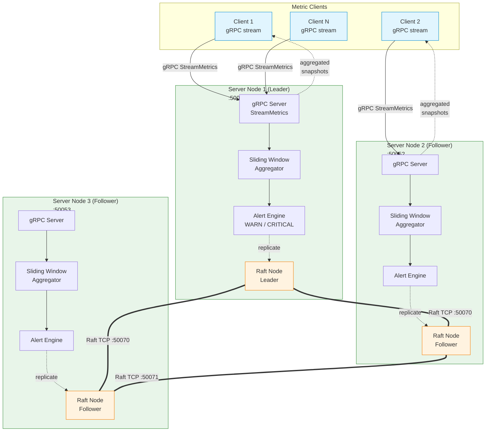
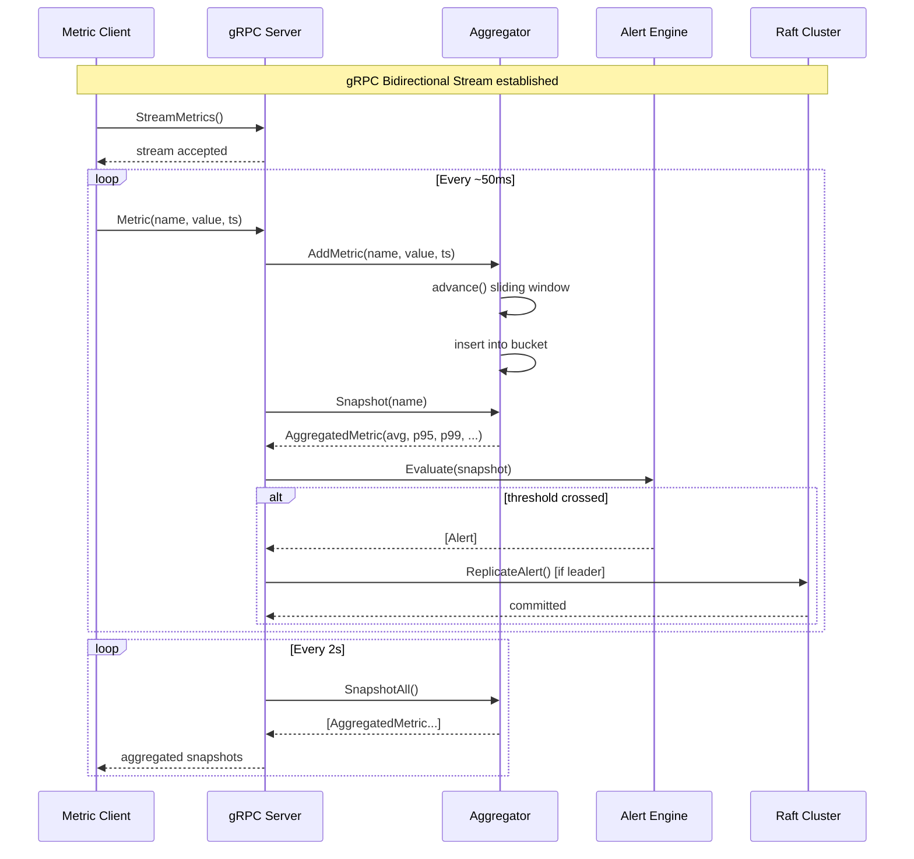
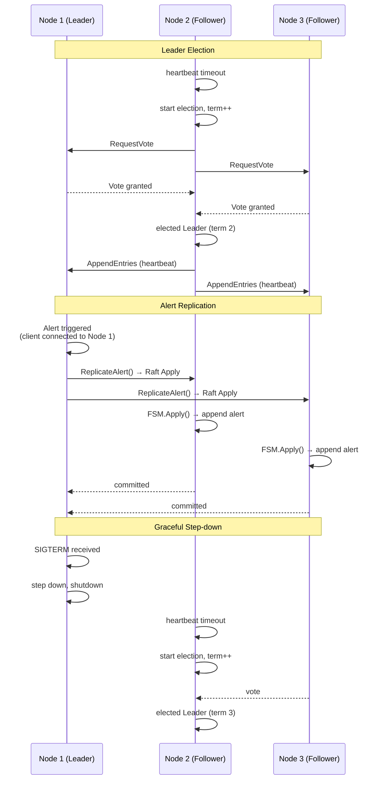
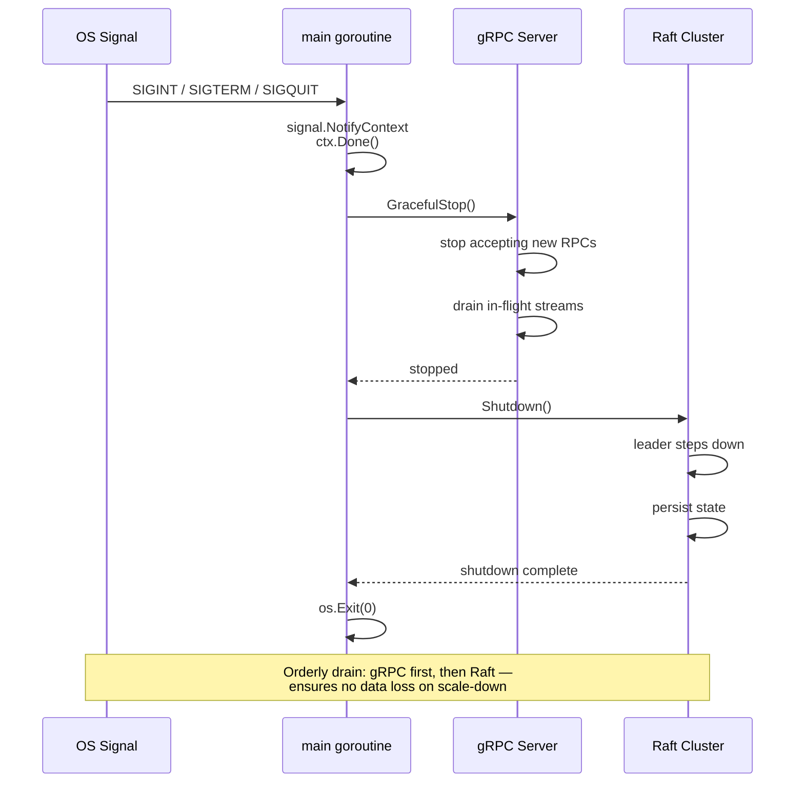

# Distributed Real-Time Metrics Aggregator

A production-grade, distributed real-time metrics aggregation and alerting engine built in Go — designed for the high-concurrency, low-latency patterns that LiveKit deals with daily.

## Architecture

### System Overview



### Data Flow



## Key Components

### 1. Transport Layer — gRPC Bidirectional Streaming (`internal/transport/`)

Uses gRPC bidirectional streaming to establish long-lived connections between clients and servers. The proto service definition:

```protobuf
service MetricsAggregator {
  rpc StreamMetrics(stream Metric) returns (stream AggregatedMetric);
  rpc SetThreshold(SetThresholdRequest) returns (SetThresholdResponse);
  rpc HealthCheck(HealthCheckRequest) returns (HealthCheckResponse);
  rpc JoinCluster(JoinClusterRequest) returns (JoinClusterResponse);
}
```

- **Backpressure**: Bounded channel (`streamSem`) limits concurrent streams per node
- **Graceful degradation**: Alerts are replicated to Raft best-effort; failures don't block metrics ingestion

### 2. Sliding Window Aggregator (`internal/aggregator/`)

Thread-safe, lock-based sliding window over configurable duration (default: 10s window, 1s buckets).

```mermaid
%%{init: {'theme': 'neutral'}}%%
graph LR
    subgraph T0["T = 0s"]
        B0_0["[0-1s]<br/>values: A,B"]
        B0_1["[1-2s]<br/>values: C"]
        B0_2["[2-3s]<br/>values: D,E,F"]
        B0_3["[3-4s]<br/>values: ∅"]
        B0_4["[4-5s]<br/>values: ∅"]
        B0_5["[5-6s]<br/>values: ∅"]
        B0_6["[6-7s]<br/>values: ∅"]
        B0_7["[7-8s]<br/>values: ∅"]
        B0_8["[8-9s]<br/>values: ∅"]
        B0_9["[9-10s]<br/>values: ∅"]
    end

    subgraph T1["T = 4s — advance by 2 buckets"]
        B1_0["[2-3s]<br/>values: D,E,F"]
        B1_1["[3-4s]<br/>values: ∅"]
        B1_2["[4-5s]<br/>values: ∅"]
        B1_3["[5-6s]<br/>values: ∅"]
        B1_4["[6-7s]<br/>values: ∅"]
        B1_5["[7-8s]<br/>values: ∅"]
        B1_6["[8-9s]<br/>values: ∅"]
        B1_7["[9-10s]<br/>values: ∅"]
        B1_8["[10-11s]<br/>values: G"]
        B1_9["[11-12s]<br/>values: ∅"]
    end

    T0 -.->|"advance: now=T+4s, windowStart=T-6s, no buckets dropped"| T1

    style B0_0 fill:#ffcdd2,stroke:#e53935
    style B0_1 fill:#ffcdd2,stroke:#e53935
    style B0_2 fill:#c8e6c9,stroke:#388e3c
    style B1_0 fill:#c8e6c9,stroke:#388e3c
    style B1_8 fill:#bbdefb,stroke:#1976d2
    style T0 fill:#f5f5f5,stroke:#9e9e9e
    style T1 fill:#f5f5f5,stroke:#9e9e9e
```



- **Concurrency**: `sync.RWMutex` per metric state → switched to full `sync.Mutex` on `Snapshot()` because `advance()` mutates bucket state
- **Windowing**: Bucket-based sliding window that only drops buckets entirely before `[now - window]` — preserves data still in range
- **Stats**: Sum, Avg, Min, Max, Count, P50, P95, P99 percentiles

### 3. Alert Engine (`internal/alert/`)

Configurable threshold-based alerting with two severity levels:

- **WARN**: Triggered when metric crosses `warn` threshold
- **CRITICAL**: Triggered when metric crosses `critical` threshold

Thresholds are set dynamically via gRPC (`SetThreshold` RPC).

### 4. Raft Consensus (`internal/raft/`)

Uses `hashicorp/raft` for distributed consensus and leader election.



- **Leader Election**: Automatic election via Raft's heartbeat mechanism
- **State Replication**: Alert events are replicated across the cluster as Raft log entries
- **FSM**: In-memory `ClusterFSM` stores recent alert events (max 1000)
- **Snapshots**: Periodic snapshots every 30s / 128 entries

### 5. Graceful Shutdown & Health (`cmd/server/main.go`)



- **OS Signal Handling**: `SIGINT`, `SIGTERM`, `SIGQUIT` trigger graceful shutdown via `signal.NotifyContext`
- **Drain Sequence**: gRPC `GracefulStop()` → Raft shutdown (leader steps down, cluster re-elects)
- **Health Check**: gRPC health endpoint reports `SERVING` status and leader state

## Getting Started

### Prerequisites

- Go 1.22+
- `protoc` + `protoc-gen-go` + `protoc-gen-go-grpc`

### Build

```bash
cd real_time_metrics_agg
go build -race -o build/metrics-server ./cmd/server
go build -race -o build/metrics-client ./cmd/client
```

### Run Single Node

```bash
# Terminal 1: Start server
./build/metrics-server \
  --node-id node1 \
  --grpc-port 50051 \
  --raft-port 50070 \
  --data-dir /tmp/raft-metrics \
  --bootstrap \
  --window 10s

# Terminal 2: Start client
./build/metrics-client 127.0.0.1:50051 test-client-1
```

### Run 3-Node Cluster

```bash
./scripts/run-cluster.sh
```

This starts nodes on ports:
| Node  | gRPC Port | Raft Port |
|-------|-----------|-----------|
| node1 | 50051     | 50070     |
| node2 | 50052     | 50071     |
| node3 | 50053     | 50072     |

Then start clients:
```bash
./build/metrics-client 127.0.0.1:50051 client-a
./build/metrics-client 127.0.0.1:50052 client-b
```

## Configuration

| Flag            | Env           | Default     | Description                      |
|-----------------|---------------|-------------|----------------------------------|
| `--node-id`     | `NODE_ID`     | `node1`     | Unique node identifier           |
| `--grpc-port`   | `GRPC_PORT`   | `50051`     | gRPC server port                 |
| `--raft-port`   | `RAFT_PORT`   | `50070`     | Raft consensus port              |
| `--data-dir`    | `DATA_DIR`    | `/tmp/raft-metrics` | Raft data directory      |
| `--bootstrap`   | —             | `false`     | Bootstrap Raft cluster (first node) |
| `--join`        | `JOIN_ADDR`   | `""`        | Join existing cluster            |
| `--window`      | —             | `10s`       | Sliding window duration          |
| `--bucket`      | —             | `1s`        | Aggregation bucket interval      |
| `--log-level`   | `LOG_LEVEL`   | `info`      | Log level (debug/info/warn/error)|

## Key Distributed Systems Concepts Demonstrated

### Data Races
Always run with `-race` flag. The aggregator uses `sync.RWMutex` to protect shared metric state. Running `go build -race` and `go run -race` catches subtle concurrency issues.

### Backpressure
- **Stream level**: Bounded channel (`streamSem`) limits concurrent gRPC streams per node
- **Aggregate level**: Buffered channel (`aggCh`) with `select/default` drops aggregates when client is slow

### Graceful Shutdown
- OS signals (`SIGINT`, `SIGTERM`) trigger ordered shutdown
- gRPC stops accepting new requests, drains in-flight streams
- Raft leader steps down, cluster re-elects

### Idempotency
- Metric timestamps are client-provided, enabling dedup on reconnect (TODO)
- Raft FSM apply is idempotent (appends to alert list)

## Project Structure

```
real_time_metrics_agg/
├── proto/
│   └── metrics.proto          # gRPC service definition
├── pb/                         # Generated protobuf code
│   ├── metrics.pb.go
│   └── metrics_grpc.pb.go
├── cmd/
│   ├── server/main.go          # Entry point with graceful shutdown
│   └── client/main.go          # Metrics streaming client
├── internal/
│   ├── config/config.go        # CLI flags + env var configuration
│   ├── aggregator/aggregator.go # Sliding window aggregation
│   ├── alert/engine.go         # Threshold-based alerting
│   ├── raft/node.go            # Raft consensus (hashicorp/raft)
│   └── transport/
│       ├── server.go           # gRPC server implementation
│       └── client.go           # gRPC client + simulation
└── scripts/
    └── run-cluster.sh          # 3-node cluster launcher
```

## LiveKit Relevance

This project directly exercises the exact patterns LiveKit's Distributed Systems Engineer role requires:

| LiveKit Requirement | This Project |
|---------------------|-------------|
| **Go fluency** | Pure Go implementation, gRPC, Raft integration |
| **Low-latency transport** | gRPC bidirectional streaming, no polling |
| **Concurrency** | `sync.RWMutex`, channels, bounded semaphores |
| **Distributed consensus** | Hashicorp Raft: leader election, log replication |
| **Observability** | Structured logging, health checks, metrics mapping |
| **Graceful degradation** | Backpressure, graceful shutdown, Raft failover |
| **Race detection** | `-race` flag throughout development |