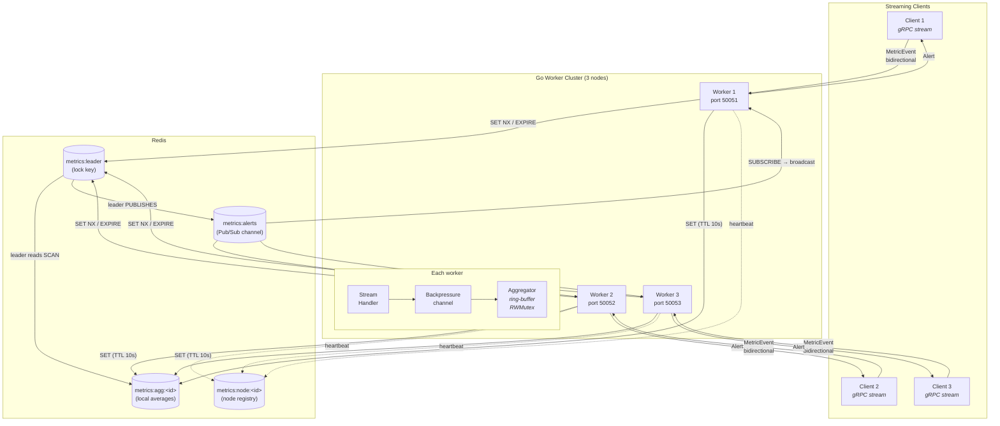
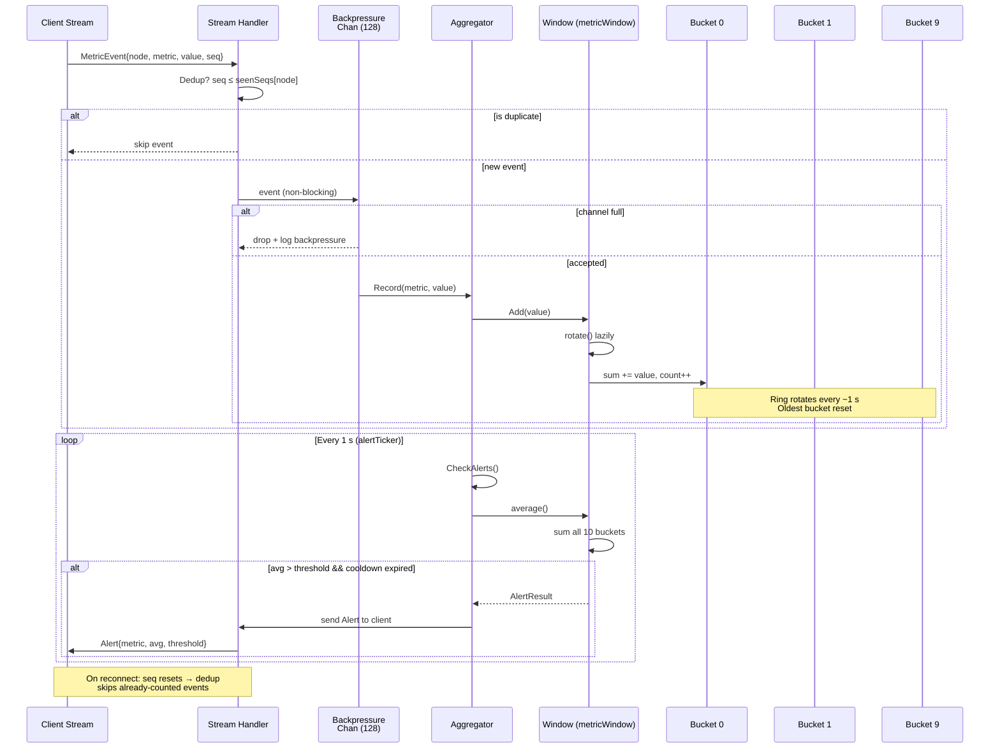
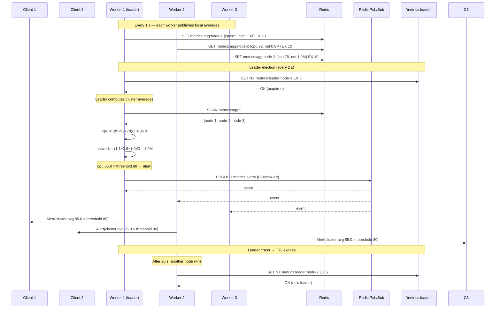

## Distributed Real-Time Metrics Aggregator

### Architecture

Multiple client nodes stream lightweight system metrics (CPU usage, network throughput, request rate) over **gRPC bidirectional streaming** to a cluster of Go backend workers. Each worker aggregates incoming values in memory over a sliding time window and pushes back an alert whenever a metric's average crosses a configured threshold.



**Legend:** solid lines = data path; dashed = discovery/heartbeat. Each worker node runs an `Aggregator`, a `Stream Handler`, and a backpressure channel. Clients reconnect automatically and attach monotonic sequence numbers for deduplication.

### What was built

1. **Transport layer – gRPC bidirectional streaming** (`server/`, `client/`, `proto/`)
   - A single `StreamMetrics` RPC carries `MetricEvent` messages from client to server and `Alert` messages from server to client over the same long-lived connection.
   - Clients reconnect automatically on any transport error, preserving the monotonic sequence number used for deduplication.

2. **In-memory sliding-window aggregator** (`aggregator/aggregator.go`)
   - Each metric is tracked in a ring-buffer of 10 one-second buckets that rotate lazily on each write (no background goroutine required).
   - Access is protected by `sync.RWMutex`; multiple concurrent streams safely write to the same `Aggregator` instance without data races.
   - Alert cooldown (5 s per metric) prevents alert storms.



3. **Distributed leader election & cluster-wide alerts – Redis** (`coordinator/`, `server/main.go`)
   - Every node competes for a Redis lock (`metrics:leader`, TTL 5 s, renewed every 2 s via `SET NX / EXPIRE`). The node that holds the lock is the **leader**.
   - Every node publishes its local per-metric sliding-window averages to `metrics:agg:<nodeID>` (TTL 10 s) once per second.
   - The leader reads all `metrics:agg:*` keys every second (using Redis `SCAN` instead of `KEYS` to avoid O(N) blocking), computes the **cluster-wide average** across all nodes, and publishes a `ClusterAlert` JSON payload to the `metrics:alerts` Pub/Sub channel whenever a threshold is crossed.
   - All nodes subscribe to `metrics:alerts` and fan out received cluster alerts to every connected gRPC stream — so a client on any node gets the leader's cluster-wide verdict.
   - If the leader crashes its TTL expires and another node wins the next election within 5 s.
   - Each node also registers a presence key (`metrics:node:<id>`) for discovery.



4. **Graceful shutdown & health checks** (`server/main.go`)
   - `os/signal` catches `SIGINT`/`SIGTERM`; the server cancels all active stream contexts, waits for every goroutine to finish (with a 10 s timeout), then calls `grpc.GracefulStop`.
   - The standard gRPC health check service (`grpc_health_v1`) is served on every worker so load-balancers and probes can detect readiness.

### Extended concepts addressed

- **Data races** – all aggregator writes go through `sync.RWMutex`; the server is built with `-race` via `make server-1/2/3`.
- **Backpressure** – each stream has a bounded `incoming` channel (128 slots); events that arrive faster than the consumer can process are dropped and logged rather than blocking the receive loop.
- **Idempotency / deduplication** – clients attach a monotonically increasing `seq` field; the server skips any event whose seq ≤ the last seen seq for that node, preventing double-counting on reconnect.
- **Redis SCAN over KEYS** – the leader uses Redis `SCAN` (cursor-based iteration) instead of `KEYS` to avoid blocking Redis for O(N) over all keys in production.
- **Client auto-discovery** – clients can query registered nodes from Redis instead of hardcoding server addresses (see `client-auto` Make target).

---

## Testing & Benchmarks

### Unit tests

| Package  | Count | What's covered |
|----------|-------|----------------|
| aggregator | 12 | Sliding-window correctness, alert firing/cooldown, per-metric independence, concurrent safety (`-race`) |
| coordinator | 6 | JSON round-trip, `New()` nil-safety, empty-map guard, threshold fallback logic |
| client     | 5  | `resolveServerAddr` decision logic, stream connect/send/recv, metric definitions |

All tests pass with the `-race` detector.

### Integration tests (build tag: `integration`)

| Package | Count | What's covered |
|---------|-------|----------------|
| server  | 3 | Full pipeline: Redis container → gRPC server → client stream → alert received, deduplication correctness, alert cooldown |
| client  | 3 | Redis node discovery (single node, no nodes, multiple nodes with random selection) |
| coordinator | 8 | Publish + read back aggregates, leader acquire/verify, exclusive election, lock renewal, key-delete failover, eval→alert pipeline, no-alert-below-threshold, Pub/Sub subscriber |

Each test spins up a real Redis 7 container via testcontainers.

### Benchmarks

```bash
# Run unit tests (build-tag-free, no Docker needed)
make test

# Run with the race detector
make test-race

# Run integration tests (requires Docker — spins up real Redis containers)
make test-integration

# Run benchmarks (record throughput, mixed workloads)
make bench
```

Benchmark results (Intel Xeon E5-2699 v4 @ 2.20 GHz):

| Benchmark                  | Ops/s  | Latency  | Allocs |
|----------------------------|--------|----------|--------|
| `BenchmarkRecord`          | 1.68 M | 771 ns   | 0      |
| `BenchmarkRecordAndCheck`  | 1.28 M | 912 ns   | 0      |
| `BenchmarkRecordAndAverages` | 761 K | 1.40 µs | 2      |
| `BenchmarkMixedWorkload`   | 260 K  | 4.65 µs  | 4      |

Zero heap allocations on hot paths (Record, CheckAlert) — critical for high-throughput, low-latency streaming.

### Integration tests (build tag: `integration`)

Three end-to-end tests in `server/integration_test.go` spin up a real Redis 7 container via testcontainers, start a full gRPC server, connect a streaming client, and verify:

| Test | What it validates |
|------|-------------------|
| `TestIntegration_EndToEndAlertFires` | Client sends metrics above threshold → server pushes back an alert |
| `TestIntegration_Deduplication` | Re-sending the same seq is ignored and doesn't skew the average |
| `TestIntegration_AlertCooldown` | Aggregator's 5 s cooldown suppresses repeated local alerts |

Run with: `make test-integration` (requires Docker, excluded from regular `make test`).

---

## Repository Layout

```
real_time_metrics_agg/
├── proto/
│   └── metrics.proto          # gRPC service definition
├── gen/                       # generated by `make proto` (do not edit)
│   ├── metrics.pb.go
│   └── metrics_grpc.pb.go
├── aggregator/
│   ├── aggregator.go          # sliding-window in-memory aggregator
│   ├── aggregator_test.go     # unit tests (12 tests, all pass with -race)
│   └── aggregator_bench_test.go # benchmarks (record throughput, mixed workloads)
├── coordinator/
│   ├── coordinator.go         # Redis leader election + cluster alert pub/sub
│   ├── coordinator_test.go    # unit tests (JSON, New, threshold fallback)
│   └── integration_test.go   # E2E tests (leader election, eval→alert, subscribe)
├── server/
│   ├── main.go                # gRPC server (bidirectional stream + Redis + health)
│   └── integration_test.go    # E2E tests (build tag: integration, needs Docker)
├── client/
│   ├── main.go                # streaming client with reconnect & deduplication
│   ├── main_test.go           # unit tests (resolveServerAddr, stream connect)
│   └── integration_test.go    # Redis discovery E2E tests (build tag: integration)
├── docker-compose.yml         # Redis + 3 server instances
├── Dockerfile                 # multi-stage build for the server binary
├── Makefile
└── README.md
```

---

## Quickstart – command order

All `make` commands are run from inside `real_time_metrics_agg/`.

### Step 1 – Install Go dependencies (first time only)

```bash
make deps
```

### Step 2 – Generate gRPC code from the proto definition (first time, or after editing the .proto)

```bash
make proto
```

### Step 3 – Start Redis

```bash
make redis-up
```

### Step 4 – Start the worker nodes (one terminal each)

```bash
# terminal A
make server-1

# terminal B
make server-2

# terminal C
make server-3
```

### Step 5 – Stream metrics from clients (one terminal each)

```bash
# terminal D  →  connects to node-1
make client

# terminal E  →  connects to node-2
make client-2

# terminal F  →  connects to node-3
make client-3
```

After ~10 seconds you will start seeing **ALERT** lines in the server terminals when the sliding-window average of `cpu`, `network`, or `requests` crosses its threshold.

### Step 6 – Run tests with the race detector

```bash
make test-race
```

### Step 7 – Tear down Redis when finished

```bash
make redis-down
```

---

## Alternative: full Docker Compose stack

Builds the server image and starts Redis + all three workers in the background.

```bash
make stack-up      # start everything
make stack-down    # stop everything
```

Clients still run locally via `make client`, `make client-2`, `make client-3`.

---

## Client auto-discovery (Redis)

Instead of manually targeting a server port, clients can discover available worker nodes from Redis and connect to a random one:

```bash
make client-auto
```

This queries the `metrics:node:*` keys that every worker registers on startup, picks one at random, and connects. If `--redis` is omitted or Redis is unreachable, the client falls back to `localhost:50051`.

You can also pass flags directly:

```bash
go run ./client --redis=localhost:6379 --node-id=my-client
```

---

## Thresholds (configurable in `aggregator/aggregator.go`)

| Metric     | Default threshold |
|------------|-------------------|
| `cpu`      | 80 %              |
| `network`  | 1 000 000 B/s     |
| `requests` | 100 req/s         |
| *(others)* | 100               |
